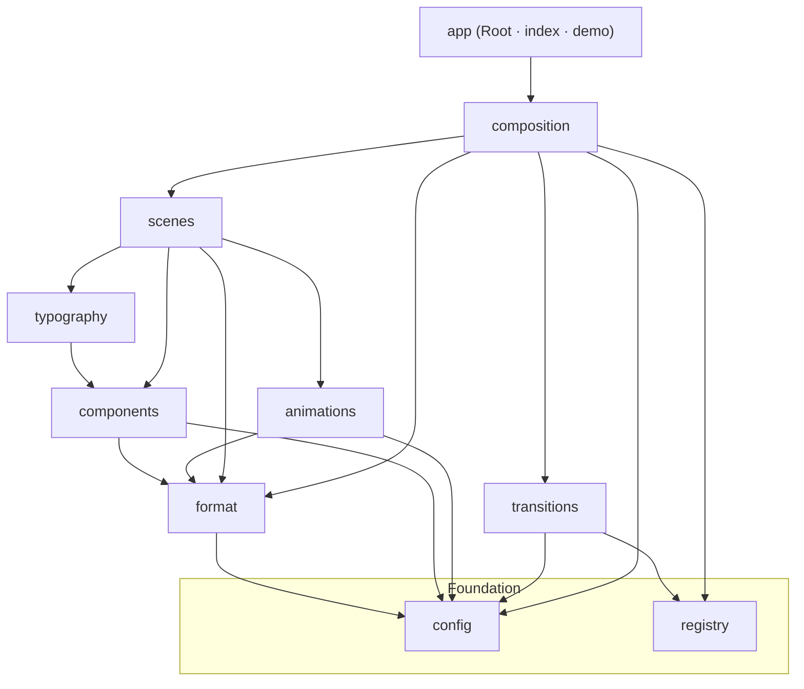

# Architecture

## Purpose

Explain the framework's layers, the dependency rules that hold them together, and *why* the
dependency direction never points upward — the single invariant that keeps every subsystem
replaceable and testable.

## Concepts

The framework is a set of **layers**, each a directory under `src/`. A layer may only import
from layers **below** it. Two layers form the foundation and depend on nothing else in the
framework.

### The layers

| Layer | Directory | Responsibility | Depends on |
|---|---|---|---|
| **config** | `src/config` | Design tokens (colors, typography, layout, timing, animation), the `theme`, the theme context, and the font loader. Pure data + a tiny context. | — (leaf) |
| **registry** | `src/registry` | The generic `Registry<M>` kernel + `createRegistry`. Domain-agnostic. | — (leaf) |
| **format** | `src/format` | Runtime: `useFormat` (orientation), `useScale` (short-side scaling), `SafeArea`. | config |
| **components** | `src/components` | Layout + text primitives: `Text`, `Container`, `Row`, `Column`, `Stack`. | config, format |
| **typography** | `src/components/typography` | Semantic type roles: `Headline`, `Quote`, `CTA`, … (compose `Text`). | components, config |
| **animations** | `src/animations` | Frame-driven motion primitives (`FadeIn`, `KenBurns`, …). | config, format |
| **scenes** | `src/scenes` | Content-agnostic full-frame scenes on a shared `SceneFrame`. | components, typography, animations, format, config |
| **transitions** | `src/transitions` | Typed transition registry over `@remotion/transitions`. | registry, config |
| **composition** | `src/composition` | The engine: schema, registries, timeline resolver, builder, brand. | registry, scenes, transitions, config, format |
| **app** | `src/index.ts`, `src/Root.tsx`, `src/demo` | Entry, root registration, example config. | composition, config/fonts |

### Framework layer diagram

## Dependency rules

1. **Downward only.** A layer imports only from layers beneath it. `config` and `registry`
   import nothing else in the framework.
2. **Type-only cross-edges are still edges.** `composition/CompositionSchema` imports *types*
   from `scenes` and `transitions`; those never import back — so there is no cycle.
3. **Foundation is domain-agnostic.** `registry` knows nothing about scenes/transitions;
   `config` knows nothing about components. Each domain layer *specializes* the foundation.
4. **The context lives at the bottom.** `useTheme()` lives in `config/ThemeContext` so any
   layer can read the active theme with a downward import — see
   [ADR-001 §3](./adr/ADR-001-typed-scene-registration.md) and [THEMING.md](./THEMING.md).
5. **The registry pattern is shared, per-family definitions are local.** All registries reuse
   `createRegistry`; each family (scenes, transitions, …) defines its own `Definition` type
   and `create<X>Definition` factory. See [REGISTRIES.md](./REGISTRIES.md).

## Why dependency direction never points upward

Upward dependencies (a lower layer importing a higher one) create **cycles** and **coupling**
that destroy the framework's core properties:

- **Testability.** Because `format`, `components`, `animations`, and the registry kernel don't
  know about `composition`, they can be unit-tested in isolation. The composition engine's
  pure logic (timeline, config resolution, registries) is tested with *fake* registries and no
  rendering (see [TESTING.md](./TESTING.md)).
- **Replaceability.** Any layer can be swapped without touching the ones below it. Brand
  theming was wired in (Phase 10A) by adding a context at the *bottom* and having primitives
  read it downward — no primitive had to import the engine.
- **No cycles.** A single upward import (e.g. a primitive importing the scene registry) would
  create `composition → scenes → components → composition`. The theme context was deliberately
  placed in `config` to avoid exactly this (ADR-001 §4).
- **Determinism of build order.** Font loading is a side effect in `config/fonts`, imported
  once at the app entry — never pulled in by a visual layer.

**Concretely:** motion (`animations`) depends only on `config` + `format`, *not* on
`components`. Scenes compose motion, typography, and layout — but a primitive never composes a
scene. The engine sits at the top and depends on everything; nothing depends on the engine
except the app entry.

## Enforcement

Today the rule is enforced by convention + code review + the fact that `tsc` fails on cycles
that would break `noUnusedLocals`/typing. A lint boundary rule
(`eslint-plugin-boundaries` / `import/no-restricted-paths`) is a documented future hardening
step (see [CONTRIBUTING.md](./CONTRIBUTING.md#architecture-rules)).

## Examples

- **Adding a color token** → edit `config/Colors.ts`. Every layer above sees it; nothing below
  changes.
- **Adding a motion primitive** → add to `animations/`; it may use `config` + `format` only.
- **Adding a scene** → add to `scenes/`, then register in `composition/SceneRegistry.ts`. The
  scene may compose components/typography/animations; it must not import from `composition`.

## Best practices

- Put shared, domain-agnostic mechanism in a foundation layer (`config`/`registry`), not in a
  domain layer.
- Prefer composing a lower primitive over re-implementing it one layer up.
- When a new cross-layer need appears, ask: "does this edge point downward?" If not, move the
  shared piece down.

## Common mistakes

- Importing a scene/engine type into a primitive (upward edge → cycle).
- Putting the theme context or a registry inside a *domain* layer instead of the foundation.
- Reaching for a raw hex/size in a component instead of a `config` token.

## Extension points

- **New foundation mechanism:** add to `config` or `registry`.
- **New domain layer:** create a directory that depends only downward, and (if it participates
  in a composition) expose it through a registry. See [REGISTRIES.md](./REGISTRIES.md) and
  [FRAMEWORK.md](./FRAMEWORK.md).
