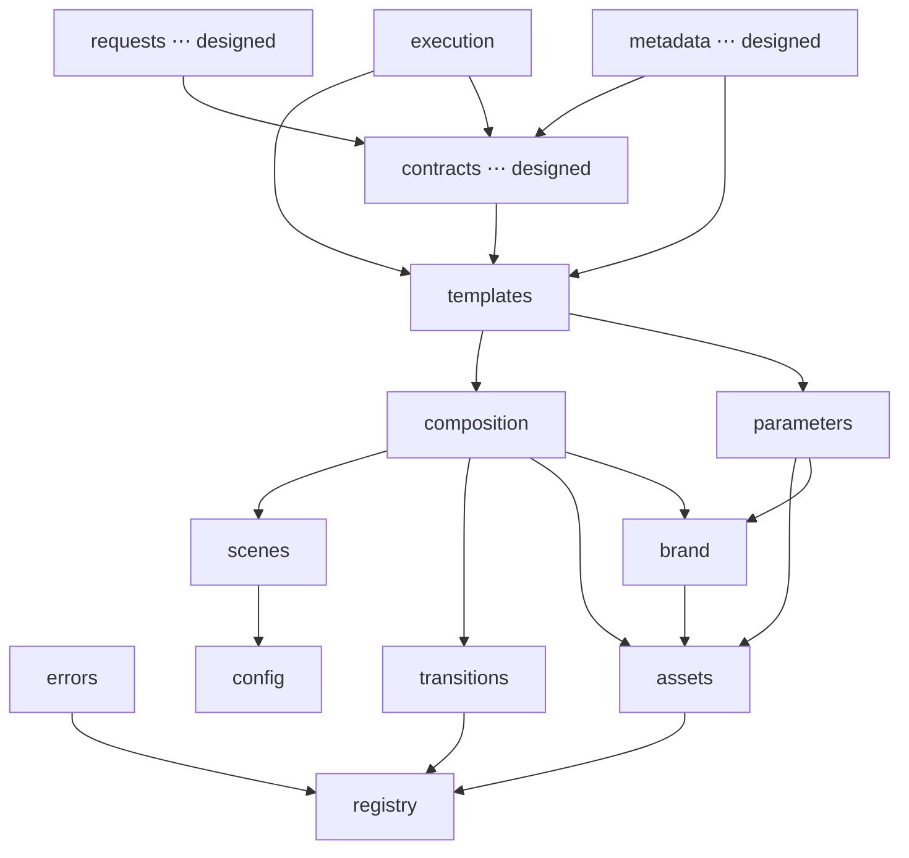

# Architecture

The **architecture index** for AI-Studio: the identity of the system, the complete layer stack
(built and designed), the engine ↔ ADR map with status, the shared architectural vocabulary, and
the invariants that hold it together. Start here; each row links to the deep reference.

## Identity

AI-Studio is a **registry-driven declarative compiler**. Video is described as *data* — a template
selected by name plus JSON parameters — and lowered through a fixed pipeline of pure passes over
typed registries into a deterministic render artifact. Mapped to a compiler:

| Compiler stage | AI-Studio |
|---|---|
| symbol tables | the typed **registries** (scenes, transitions, assets, brands, templates, parameter types) |
| source | a `TemplateComposition` (template name + params + overrides) |
| lexer / parser + envelope check | **Request Processing** (ADR-008, designed) — untrusted JSON → validated request |
| type system + semantic analysis | **Parameter Engine** (ADR-006) — `ParameterSchema` + `resolveParameters` |
| lowering to IR | **Template Engine** (ADR-005) — `resolveTemplateComposition` → `CompositionSchema` |
| code generation | **Composition Engine** — `buildComposition` → a React tree |
| driver + diagnostics | **Execution Engine** (ADR-007) — `execute` → `ExecutionReport` |
| symbol-table dump / reflection | **Metadata Engine** (ADR-009, designed) — `describeFramework` |

Everything up to the terminal `BuiltComposition` is **serializable and React-free**; React is
confined to the final artifact.

## The layer stack (low → high)

A layer may import only from layers **below** it. `errors`, `registry`, and `config` depend on
nothing else in the framework.

| Layer | Directory | Responsibility | Depends on | Status |
|---|---|---|---|---|
| **errors** | `src/errors` | `DomainError` (expected-error base) + `sanitize` (JSON-safe diagnostics). `Result<T,E>` relocates here in Phase 25. | — (leaf) | Built |
| **registry** | `src/registry` | The generic `Registry<M>` kernel + `createRegistry`; domain-agnostic. | errors | Built |
| **config** | `src/config` | Design tokens (color, type, layout, timing, easing), `theme`, `ThemeContext`, font loader. | — (leaf) | Built |
| **format / components / typography / animations** | `src/format`, `src/components`, `src/animations` | Canvas resolution; layout + text primitives; semantic type roles; frame-driven motion. | config, format | Built |
| **scenes** | `src/scenes` | Content-agnostic full-frame scenes on a shared `SceneFrame`. | components, typography, animations, format, config | Built |
| **transitions** | `src/transitions` | Typed transition registry + capabilities + opacity contract. | registry, config | Built |
| **assets** | `src/assets` | `AssetDefinition` + kits + resolvers + `AssetRegistryProvider`. | registry, config, errors | Built |
| **brand / branding** | `src/brand`, `src/branding` | Brand packs + `resolveBrand` + `BrandProvider`; `BrandLogo`/`Watermark`. | assets, transitions, config, registry | Built |
| **composition** | `src/composition` | `CompositionSchema`, `Timeline`, `buildComposition` — the assembler. | scenes, transitions, assets, brand, config, registry, errors | Built |
| **parameters** | `src/parameters` | Parameter-type registry + `ParameterSchema` + `resolveParameters` (a parallel branch). | assets/brand *types*, config, registry, errors | Built |
| **templates** | `src/templates` | `TemplateDefinition` + `buildFromTemplate` + public stage helpers. | composition, parameters, registry, errors | Built |
| **execution** | `src/execution` | `execute` / `executeOrThrow` — orchestration + diagnostics; owns no rules. | templates, composition, parameters, errors | Built |
| **contracts** | `src/contracts` | Neutral shared protocol: `ExecutionRequest`, `FrameworkRegistries`, `RegistryFamily`, `Diagnostic<S>`/`Report<S>`. | family *types*, errors | **Designed** — ADR-008 (Phase 25) |
| **requests** | `src/requests` | Request Processing: untrusted JSON → validated `ExecutionRequest` (parse → migrate → validate → normalize). | contracts, errors | **Designed** — ADR-008 (Phase 25) |
| **metadata** | `src/metadata` | Pure reflection: `describeFramework` / `describe*` / `getCapabilities`. | contracts, family *types*, errors | **Designed** — ADR-009 (after Phase 25) |
| **app** | `src/index.ts`, `src/Root.tsx`, `src/demo` | Entry, root registration, example config. | composition, config/fonts | Built |

**Parallel branches:** `parameters` (content validation) and `composition` (assembly) are
orthogonal — neither imports the other — and both feed `templates`. `execution`, `requests`, and
`metadata` are **top consumers**: nothing imports them.

## Engines ↔ ADRs

| Engine | Layer | ADR | Status |
|---|---|---|---|
| Registry kernel / typed scene registration | `registry`, `scenes` | [ADR-001](./adr/ADR-001-typed-scene-registration.md) | Built (Phase 10D) |
| Transition Engine | `transitions` | [ADR-002](./adr/ADR-002-transition-architecture.md) | Built (Phase 12) |
| Asset Engine | `assets` | [ADR-003](./adr/ADR-003-asset-engine.md) | Built (Phase 15) |
| Brand System | `brand`, `branding` | [ADR-004](./adr/ADR-004-brand-system.md) | Built (Phase 17) |
| Composition Engine | `composition` | — (Phase 8) | Built |
| Template Engine | `templates` | [ADR-005](./adr/ADR-005-template-engine.md) | Built (Phase 19) |
| Parameter Engine | `parameters` | [ADR-006](./adr/ADR-006-parameter-engine.md) | Built (Phase 21) |
| Lifecycle & Execution Engine | `execution` | [ADR-007](./adr/ADR-007-lifecycle-execution-engine.md) | Built (Phase 23) |
| Request Processing Pipeline + `contracts` | `requests`, `contracts` | [ADR-008](./adr/ADR-008-request-processing-pipeline.md) | **Accepted — Phase 25** |
| Metadata Engine | `metadata` | [ADR-009](./adr/ADR-009-metadata-engine.md) | **Accepted — after Phase 25** |

Planned architectural ADRs (see [ROADMAP.md](./ROADMAP.md)): **ADR-010** AI Director,
**ADR-011** Plugin Runtime & Lifecycle Hooks, **ADR-012** Rendering & Delivery.

## Architectural vocabulary

The same recipe repeats across every family — this is the framework's design language:

- **Definition** — a bound, typed unit (`SceneDefinition`, `TransitionDefinition`, `AssetDefinition`,
  `BrandDefinition`, `TemplateDefinition`, `ParameterTypeDefinition`).
- **`create*Definition<T>`** — the identity factory capturing the type parameter.
- **Registry / `createRegistry`** — the typed symbol table; `extend` is immutable.
- **Resolver** — the erased runtime lookup (`require → Def<any>`), so concrete registries stay assignable.
- **Provider / Context** — Providers for render-tree families (theme, asset, brand); Contexts for
  data threading (`TemplateContext`, `ExecutionContext`, `ParameterContext`).
- **Schema** — declarative shapes (`CompositionSchema`, `ParameterSchema`).
- **Capabilities vs Metadata** — machine-read (enforced) vs human-facing (inert); kept separate everywhere.
- **`resolve*`** — fold config → concrete (`resolveBrand`, `resolveParameters`, `resolveTemplateComposition`, `resolveTimeline`).
- **Result / DomainError / sanitize** — the error model: `Result` at boundaries, `DomainError` for
  expected failures, `sanitize` for JSON-safe diagnostics.
- **Report** — append-only, deterministic, JSON-safe diagnostics (`ExecutionReport`, `RequestReport`).
- **Descriptor** — serializable projection of a Definition (Metadata).
- **name-selection** — the serialization boundary: consumers select by *name*; code lives behind the name.

See [REGISTRIES.md](./REGISTRIES.md) for the family recipe and [API.md](./API.md) for the surface.

## Invariants

1. **Downward-only dependencies.** A layer imports only from layers beneath it; `errors`/`registry`/
   `config` import nothing else. Type-only cross-edges are still edges and never point up — proven by
   dependency-direction tests. No cycles.
2. **Serialization boundary.** Selection and diagnostics are name-based JSON; ReactNode-producing code
   (components, `build`, `presentation`, asset kits) lives behind names. Request Processing (ADR-008)
   turns untrusted input into a *guaranteed*-JSON request; React never crosses the request /
   diagnostics / AI-observation contracts — only the terminal `BuiltComposition` is opaque React.
3. **Execution boundary.** `execute` inputs and reports are React-free; the `BuiltComposition` is an
   opaque artifact handed to the renderer.
4. **Syntax vs semantics (ADR-008).** Request Processing validates transport *syntax* (structure,
   version, JSON-safety) and touches no registry; Execution validates *semantics* (existence, schema)
   against the registries. Neither duplicates the other.
5. **Purity / immutability / determinism.** Passes are pure; `extend`, resolved params, execution
   context, and reports are immutable/append-only; output is deterministic (no clock/random).
6. **Reflection is read-only (ADR-009).** Metadata *describes* — it never executes, renders, mutates a
   registry, or becomes a second source of truth. Definitions remain authoritative.
7. **Reserve, don't build.** Capabilities and extension points are declared where they clarify intent,
   but inert surface is deferred until a real consumer exists (lifecycle hooks, plugin runtime,
   dependency graphs, consumer-specific projections).

## Why direction never points upward

Upward edges create cycles and coupling that destroy testability, replaceability, and deterministic
build order. Because the lower layers don't know about the engines, the pure logic (timeline, config
resolution, parameter validation, execution orchestration) is unit-tested with *fake* registries and
no rendering (see [TESTING.md](./TESTING.md)). Any layer can be swapped without touching those beneath
it — brand theming was wired by adding a context at the *bottom* and reading it downward, so no
primitive imports the engine.

## Enforcement

Downward-only is enforced by convention + review + `tsc` (cycles break typing) + **dependency-direction
tests** (e.g. `execution`/`templates` must not import each other's forbidden direction; nothing imports
the top consumers). A lint boundary rule (`import/no-restricted-paths`) is a documented future hardening
step (see [CONTRIBUTING.md](./CONTRIBUTING.md)).

## Where to go next

- **Build a video from config** → [AUTHORING_GUIDE.md](./AUTHORING_GUIDE.md)
- **The registry family recipe** → [REGISTRIES.md](./REGISTRIES.md)
- **Public API surface** → [API.md](./API.md)
- **Roadmap + remaining ADRs** → [ROADMAP.md](./ROADMAP.md)
- **Every architectural decision** → [`docs/adr/`](./adr/) (ADR-001 … ADR-009)
