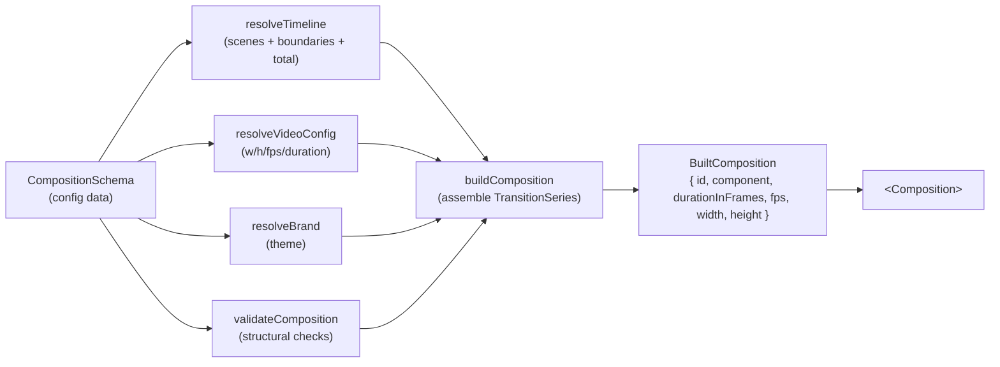

# Composition Engine

## Purpose

Document the engine that turns a `CompositionSchema` (data) into a `<Composition>`-ready
descriptor — validation, canvas resolution, brand resolution, timeline resolution, and
programmatic assembly. Lives in `src/composition`.

## Concepts

The engine is a pure pipeline of small, testable functions:



### Pieces

| Module | Role |
|---|---|
| `CompositionSchema.ts` | The declarative shape (typed via registries) + `validateComposition`. |
| `VideoConfig.ts` | `resolveVideoConfig` — format preset / explicit dims / duration → `{ width, height, fps, durationInFrames? }`. |
| `SceneRegistry.ts` | Typed scene registry (`sceneRegistry`, `defineScene`, `builtinScenes`). |
| `Timeline.ts` | `resolveTimeline` — scenes + boundary transitions + clamped frames + total. |
| `CompositionBuilder.ts` | `buildComposition` — validates, resolves, assembles the tree, returns `BuiltComposition`. |

### The timeline model

`resolveTimeline` produces the **slim** model (ADR-002 §5):

- `scenes[]` — each `{ durationInFrames, opaque, component, props, … }`.
- `boundaries[]` — same length as `scenes`; `boundaries[i]` is the transition **into**
  `scenes[i]` (`boundaries[0]` is a 0-frame cut). Each carries the resolved transition
  definition, options, and **clamped** overlap frames (`≤ min(neighbour durations)`).
- `durationInFrames = Σ(scene frames) − Σ(boundary frames)`.

It also enforces the **opacity contract**: a transition whose `requiresOpaqueIncoming` is set
is rejected against a non-opaque incoming scene (see [TRANSITIONS.md](./TRANSITIONS.md)).

### Assembly

`buildComposition` groups scenes into **runs** of transition-connected scenes (split at
0-frame "cut" boundaries) and renders each run as a positioned `<Sequence>` wrapping a
`<TransitionSeries>` (interleaved `.Sequence` / `.Transition`). Music (`<Audio>`) and
`BrandProvider` are outer siblings, so audio continuity and brand theming are preserved.
Everything is built with `React.createElement` — no hardcoded JSX.

## Examples

```ts
import { buildComposition, defineBrand, sceneRegistry, transitionRegistry } from "./composition";
import { createRegistry } from "./registry";
import { defineAsset } from "./assets";

// Brands and assets are registered and referenced by name (never inlined).
const brands = createRegistry({
  promo: defineBrand({ name: "Promo", mode: "dark", theme: { colors: { accent: "#00E0C6" } } }),
});
const assets = createRegistry({ bed: defineAsset({ category: "audio", source: "audio/bed.mp3" }) });

const built = buildComposition(
  {
    id: "Promo",
    format: "vertical",
    duration: 12,                       // optional; else derived from scenes
    brand: "promo",                     // a registered brand, by name
    music: { asset: "bed", volume: 0.6 }, // a registered audio asset, by name
    transitions: { type: "fade", duration: 0.5 },
    scenes: [
      { scene: "hero",  duration: 3.5, props: { title: "…" } },
      { scene: "quote", duration: 3,   props: { quote: "…", attribution: "…" } },
      { scene: "outro", duration: 3,   props: { title: "…" } },
    ],
  },
  sceneRegistry,
  transitionRegistry,
  assets,
  brands,
);
```

Custom registries via the second overload:

```ts
const studio = sceneRegistry.extend({ myScene: defineScene<MyProps>({ component: MyScene }) });
buildComposition({ id, scenes: [{ scene: "myScene", props: { … } }] }, studio);
```

## Best practices

- Let duration derive from scenes unless you need a fixed length; if you set `duration`, keep
  it ≥ the content length (the engine clamps to ≥ 1 frame but won't extend content).
- Reference assets by registry name (`assets`) so references live in one place.
- Keep the builder free of business logic — express variation through config + registries.

## Common mistakes

- Expecting `resolveTimeline` to place absolute frame windows — it no longer does;
  `TransitionSeries` owns overlap timing (ADR-002).
- Setting a transition longer than a neighbouring scene — it's clamped; make scenes long enough
  for the overlap you want.
- Passing an unregistered scene/transition name — a compile error at the config surface, a
  thrown error at resolve time for dynamic names.

## Extension points

- Custom scenes/transitions via `.extend()` (see the registries doc).
- Additional config fields flow through `CompositionSchema` + `resolveTimeline`; keep the
  erased `*Base` shapes in sync so the builder stays type-safe.
