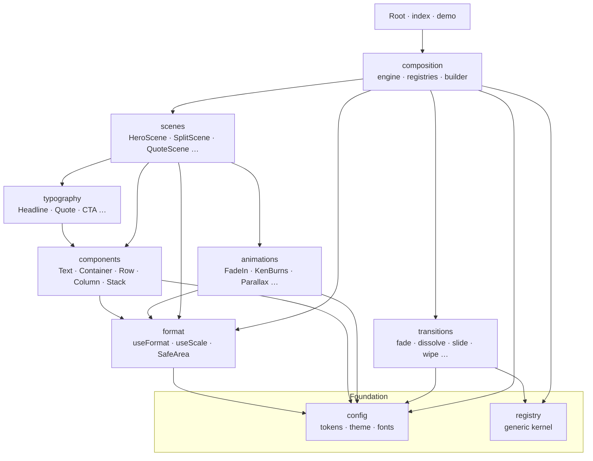

# AI-Studio — a configuration-driven video framework

AI-Studio is a [Remotion](https://remotion.dev) framework for building brand-consistent,
multi-format videos **from configuration instead of hand-written React trees**. You describe
a video as data — scenes, transitions, brand, music — and the engine assembles the final
`<Composition>`.

> **Status:** core architecture stable through Phase 12. See [ROADMAP.md](./ROADMAP.md).

---

## Purpose

Turn a declarative object into a rendered video:

```ts
buildComposition({
  id: "Promo",
  format: "horizontal",
  transitions: { type: "fade", duration: 0.5 },
  scenes: [
    { scene: "hero",     duration: 3.5, props: { eyebrow: "Composition Engine", title: "AI Studio" } },
    { scene: "centered", duration: 3,   props: { title: "Everything composes", body: "…" } },
    { scene: "outro",    duration: 3,   props: { title: "Rendered end to end" } },
  ],
});
```

Every name (`"hero"`, `"fade"`) and every `props` object is **compile-checked** against the
registries. Fonts render deterministically. Brand colors flow through context. Motion is
frame-driven. All of it is testable without rendering.

## Philosophy

- **Configuration over code.** A video is data; the builder assembles it programmatically
  (via `React.createElement`, never hardcoded JSX).
- **Strict layering.** Dependencies only ever point *downward* (see the diagram). This keeps
  every subsystem replaceable and independently testable.
- **Type-safety at the authoring surface.** Scene/transition names and props are typed via
  registries derived from a single source of truth ([ADR-001](./adr/ADR-001-typed-scene-registration.md)).
- **Determinism.** Fonts are vendored and gated ([FONTS.md](./FONTS.md)); no render-time network.
- **One green gate.** `npm run verify` = lint + typecheck + tests.
- **No business logic in the framework.** Brands, content, and assets are supplied per video.

## Framework layer diagram



Arrows point from *dependent → dependency*. Nothing points upward — see
[ARCHITECTURE.md](./ARCHITECTURE.md#why-dependency-direction-never-points-upward).

## Quick start

```bash
npm install
npm run dev          # Remotion Studio (interactive preview)
npm run verify       # lint + typecheck + tests — the single green gate
npx remotion render Demo out/demo.mp4   # render the demo composition
```

## Example: build a video

1. Describe it as a `CompositionSchema` (a `src/demo/DemoConfig.ts`-style object).
2. Assemble it with `buildComposition(config)`.
3. Register the descriptor in `src/Root.tsx`:

```tsx
import { Composition } from "remotion";
import { buildComposition } from "./composition";
import { myConfig } from "./demo/MyConfig";

const built = buildComposition(myConfig);

export const MyVideo: React.FC = () => (
  <Composition
    id={built.id} component={built.component}
    durationInFrames={built.durationInFrames} fps={built.fps}
    width={built.width} height={built.height}
  />
);
```

See [AUTHORING_GUIDE.md](./AUTHORING_GUIDE.md) for the full walkthrough.

## Documentation map

| Doc | What it covers |
|---|---|
| [ROADMAP.md](./ROADMAP.md) | Completed / current / next / future phases |
| [ARCHITECTURE.md](./ARCHITECTURE.md) | Layers, dependency rules, why nothing points up |
| [FRAMEWORK.md](./FRAMEWORK.md) | The framework as a whole; how the pieces connect |
| [API.md](./API.md) | Every exported public API with signatures + examples |
| [AUTHORING_GUIDE.md](./AUTHORING_GUIDE.md) | Create scenes, transitions, compositions, themes, brands, assets |
| [REGISTRIES.md](./REGISTRIES.md) | The generic registry kernel + all registry families |
| [COMPOSITION_ENGINE.md](./COMPOSITION_ENGINE.md) | Schema → timeline → builder pipeline |
| [SCENES / BUILDING_CUSTOM_SCENES.md](./BUILDING_CUSTOM_SCENES.md) | Scene primitives + custom scenes |
| [TRANSITIONS.md](./TRANSITIONS.md) / [BUILDING_CUSTOM_TRANSITIONS.md](./BUILDING_CUSTOM_TRANSITIONS.md) | Transition engine + custom transitions |
| [THEMING.md](./THEMING.md) | Tokens, theme context, brand overrides |
| [TYPOGRAPHY.md](./TYPOGRAPHY.md) · [MOTION.md](./MOTION.md) · [LAYOUT.md](./LAYOUT.md) | Subsystem references |
| [FONTS.md](./FONTS.md) | Deterministic, provider-based font loading |
| [TESTING.md](./TESTING.md) | `verify`, lint, tests, type tests, render smoke tests |
| [CONTRIBUTING.md](./CONTRIBUTING.md) | Standards, architecture rules, naming, ADRs |
| [adr/](./adr/) | Architecture Decision Records (ADR-001, ADR-002) |

## Verify

```bash
npm run verify
```

Runs `eslint src && tsc` (production lint), `tsc -p tsconfig.test.json` (test typecheck), and
`vitest run` (unit + structural + type tests). This is the gate every change must pass.
