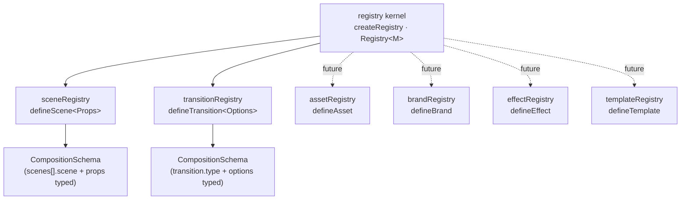

# Registries

## Purpose

Document the generic registry kernel and the pattern every registry family follows, so scenes,
transitions, and future families (assets, brands, effects, templates) stay consistent and
type-safe. Canonical decision: [ADR-001](./adr/ADR-001-typed-scene-registration.md).

## Concepts

A **registry** maps string keys to **definitions** of a single family. The runtime lookup and
all config types are derived from **one typed map** (the single source of truth), so a
misspelled name or prop is a compile error, not a silent failure.

### Registry relationship diagram



## The generic kernel — `src/registry`

```ts
export type DefinitionMap = Record<string, unknown>;

export interface Registry<M extends DefinitionMap> {
  readonly entries: M;
  keys(): (keyof M & string)[];
  has(key: string): boolean;
  get<K extends keyof M & string>(key: K): M[K];   // typed lookup
  require(key: string): M[keyof M];                // dynamic lookup; throws if absent
  extend<E extends DefinitionMap>(entries: E): Registry<Omit<M, keyof E> & E>;  // immutable
}

export const createRegistry: <M extends DefinitionMap>(entries: M) => Registry<M>;
```

- **`entries` / `keys` / `has` / `get` / `require`** — read the map.
- **`extend`** — returns a *new* registry with added/overriding entries; the original is never
  mutated (hermetic, and safe for tests and third-party additions).

## The three-part recipe

Every family follows the same recipe:

1. A **`Definition` type** describing one entry.
2. A **`create<X>Definition<T>()`** factory that binds the value and captures the type `T`.
3. A **`satisfies`-checked map** + a default instance via `createRegistry`, plus a
   `ConfigFor<M>` mapped-union when the family participates in the schema.

### `defineScene` (scenes)

```ts
export type SceneDefinition<P> = { component: React.ComponentType<P>; defaultDuration: number; opaque?: boolean };

export const builtinScenes = {
  hero:  defineScene<HeroSceneProps>({ component: HeroScene }),
  quote: defineScene<QuoteSceneProps>({ component: QuoteScene }),
  // …
} satisfies SceneMap;

export const sceneRegistry = createRegistry(builtinScenes);
```

`CompositionSchema` derives `SceneConfigFor<M>` — a union discriminated on `scene`, where each
name accepts exactly that scene's props. See [BUILDING_CUSTOM_SCENES.md](./BUILDING_CUSTOM_SCENES.md).

### `defineTransition` (transitions)

```ts
export type TransitionDefinition<Options> = {
  presentation: (options: Options | undefined, ctx: TransitionContext) => TransitionPresentation<any>;
  defaultDurationInFrames?: number;
  capabilities: TransitionCapabilities;   // affectsEntering/Exiting, requiresOpaqueIncoming, supportsTransparency
};

export const builtinTransitions = {
  fade:     defineTransition({ presentation: () => fade(), capabilities: { … } }),
  dissolve: defineTransition({ presentation: () => dissolve(), capabilities: { … } }),
  slide:    defineTransition<SlideOptions>({ presentation: (o) => slide({ direction: o?.direction }), capabilities: { … } }),
  // …
} satisfies TransitionMap;

export const transitionRegistry = createRegistry(builtinTransitions);
```

See [BUILDING_CUSTOM_TRANSITIONS.md](./BUILDING_CUSTOM_TRANSITIONS.md).

## Third-party / custom additions

`extend` keeps types and runtime in one source (no module augmentation, no drift):

```ts
const studio = sceneRegistry.extend({
  testimonialWall: defineScene<TestimonialWallProps>({ component: TestimonialWall, defaultDuration: 6 }),
});
buildComposition({ id, scenes: [{ scene: "testimonialWall", props: { … } }] }, studio);
```

## Future registries

Each follows the identical recipe (ADR-001 §6). Scenes, Transitions, Assets, Brands, Templates, and
Parameter Types are implemented; Effects remains future.

| Family | Definition + factory | Default instance | Config discriminant |
|---|---|---|---|
| Scenes | `SceneDefinition` / `defineScene` | `sceneRegistry` | `scene` |
| Transitions | `TransitionDefinition` / `defineTransition` | `transitionRegistry` | `transition` (`type`) |
| **Assets** | `AssetDefinition` / `defineAsset` | `assetRegistry` | `asset` |
| **Brands** | `BrandDefinition` / `defineBrand` | `brandRegistry` | `brand` |
| **Templates** | `TemplateDefinition` / `defineTemplate` | `templateRegistry` | `template` |
| **Parameter Types** | `ParameterTypeDefinition` / `defineParameterType` | `parameterTypeRegistry` | `type` |
| Effects _(future)_ | `EffectDefinition` / `defineEffect` | `effectRegistry` | `effect` |

The **Parameter Types** family (ADR-006) is the type *vocabulary* for the Parameter Engine —
`parameterTypeRegistry` ships the built-in types (string/number/color/image/brand/…), extended with
`.extend(...)`. A parameter type owns **behavior** (`parse`/`validate`); a template's
per-parameter **policy** (required/default/constraints/…) lives in an embedded `ParameterSchema`,
not the registry. The empty `validatorRegistry` holds named custom validators. See
[ADR-006](./adr/ADR-006-parameter-engine.md).

The **Templates** family is the fifth instance of the recipe but operates one level up: a
`TemplateDefinition<P>` is a pure `params → TemplateOutput` producer selected by a
`TemplateComposition` (not `CompositionSchema`), and `buildFromTemplate` merges its output and
delegates to `buildComposition` — the single assembly pipeline. See
[ADR-005](./adr/ADR-005-template-engine.md).

## Examples

```ts
import { createRegistry } from "./registry";

const colors = createRegistry({ brandA: "#4B2142", brandB: "#0E1B2B" });
colors.keys();          // ["brandA", "brandB"]
colors.get("brandA");   // "#4B2142" (typed)
colors.require("nope"); // throws: Registry: no entry registered as "nope". Registered: brandA, brandB.
const more = colors.extend({ brandC: "#00E0C6" });  // new registry; `colors` unchanged
```

## Best practices

- Define a family's entries in **one** `satisfies`-checked map — never a separate parallel list.
- Use `create<X>Definition` so the entry's type is captured for config inference.
- Prefer `.extend()` for additions (immutable, typed) over any mutable global registration.
- Keep the kernel domain-agnostic; family specifics live in the family's module.

## Common mistakes

- Writing the runtime map and the config types in two places (they drift — that's the E1/E3
  problem ADR-001 fixed).
- Mutating a shared registry instead of `.extend()`-ing a new one.
- Passing a non-literal name to a typed config (the union can't narrow — use `as` or a helper).

## Extension points

To add a family: create `Definition` + `create<X>Definition` + a `satisfies`-checked map +
`createRegistry(map)`, and (if it appears in the schema) a `ConfigFor<M>` mapped-union. That's
the whole pattern — see the scenes/transitions modules as reference implementations.
