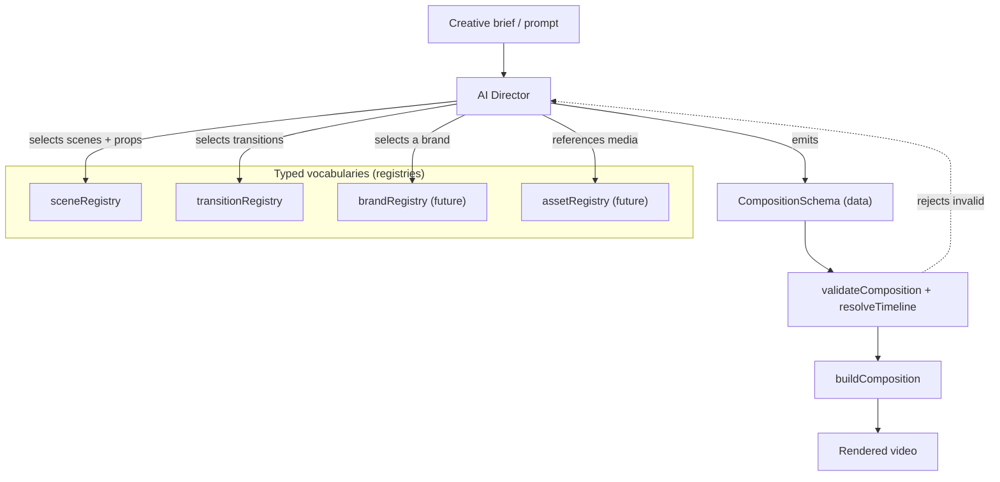

# Roadmap

## Purpose

Track the framework's architectural evolution — what is done, what is in progress, and where
it is going — so contributors understand the trajectory and the stability guarantees at each
layer.

## Concepts

Development proceeds in **phases**. Each phase is a self-contained, reviewed, committed unit
that ends green on `npm run verify`. Architectural decisions are captured as
[ADRs](./adr/). The core is considered **stable through Phase 12**.

## Completed

| Phase | Title | Outcome |
|---|---|---|
| 2 | Project Architecture Scaffold | Layer folders + conventions |
| 4 | Core UI Primitives | `Text`, `Container`, `Row`, `Column`, `Stack` |
| 5 | Typography Component Library | `Headline`, `Subheadline`, `Paragraph`, `Caption`, `Eyebrow`, `Kicker`, `Quote`, `CTA` |
| 6 | Motion Primitive Library | `FadeIn/Out/Up/Down/Left/Right`, `ScaleIn`, `BlurReveal`, `HeroReveal`, `KenBurns`, `Float`, `Parallax` |
| 7 | Scene Primitive Library | 10 content-agnostic scenes on a shared `SceneFrame` |
| 8 | Composition Engine | `CompositionSchema`, registries, `Timeline`, `buildComposition` |
| 9 | End-to-End Integration | Config-driven demo renders through the full stack |
| 10A | Dynamic Brand Theme Wiring | `useTheme()` context; brand color overrides actually recolor |
| 10B | Test Foundation | Vitest + two-tsconfig split + `verify` gate |
| 10C | Deterministic Font System | Provider-based font loading; vendored + gated |
| 10D | Typed Scene Registration | `createSceneDefinition`, generic registry kernel ([ADR-001](./adr/ADR-001-typed-scene-registration.md)) |
| 12 | Transition Engine | `TransitionSeries` + typed `transitionRegistry` + opacity contract ([ADR-002](./adr/ADR-002-transition-architecture.md)) |
| 13 | Developer Platform & Documentation | This documentation set |

All architecture-review "fix now" findings (T1, T3, Q1, E1, E3, E4, X3) are resolved.

## Current

- **Phase 13 — Developer Platform & Documentation** (this set): docs for every subsystem,
  diagrams, contribution + testing guides. No runtime changes.

## Next

Candidate next phases (not yet scheduled):

- **Asset registry** — a typed `assetRegistry` (see [REGISTRIES.md](./REGISTRIES.md)) for
  named media, replacing raw `AssetRef` strings with definitions + validation.
- **Brand packs** — a `brandRegistry` shipping reusable brand definitions (theme overrides +
  marks + default music), building on `resolveBrand`.
- **Broaden `ThemeOverrides`** — allow brand overrides beyond colors (typography, spacing,
  motion feel), addressing review finding T2.
- **Render-context test harness** — visual snapshot / `document.fonts.check` assertions to
  complement the pure + structural tests.

## Future

- **Effect registry** — post-processing/overlay effects as typed definitions.
- **Template registry** — reusable, parameterized multi-scene templates.
- **Audio-aware transitions** — cross-fade scene-embedded audio at boundaries.
- **AI Director** — generate a validated `CompositionSchema` from a brief, selecting scenes,
  transitions, and a brand from the registries.

### AI Director — future architecture

The registries are deliberately designed so an AI Director can treat them as a typed
vocabulary: it never emits React, only a `CompositionSchema` that the existing engine
validates and assembles.

The engine is the AI Director's guardrail: an invalid name, prop, or opacity-contract
violation is rejected before a frame renders.

## Best practices

- One phase = one reviewed, green commit. Don't mix unrelated changes.
- Record non-obvious architectural decisions as an ADR before implementing.

## Common mistakes

- Adding a feature without a phase boundary or `verify` gate.
- Introducing a capability the registries can't describe (an AI Director then can't use it).

## Extension points

Each "Next"/"Future" item is a new registry family on the existing kernel — see
[REGISTRIES.md](./REGISTRIES.md#future-registries).
