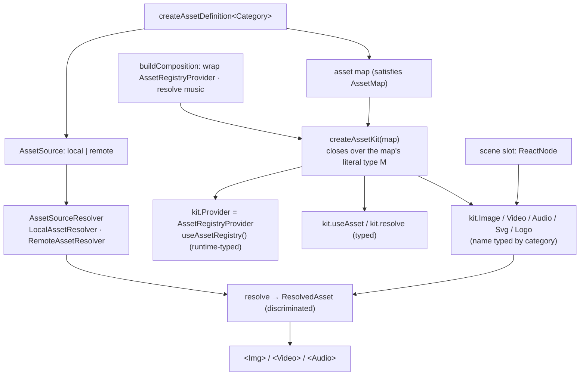

# ADR-003 — Asset Engine (typed asset kit + source resolvers + discriminated resolution)

- **Status:** Accepted — Phase 15 implementation (MVP)
- **Date:** 2026-07-17
- **Deciders:** Framework architecture
- **Related:** ADR-001 (registry kernel), the font provider (deterministic loading), the theme
  context (downward-wired context). Consumes the empty `branding`/`backgrounds`/`effects`/
  `music`/`icons` layers (later phases).

---

## 1. Context

Assets today are untyped strings: `AssetRef = string`, `AssetCatalog = Record<string,string>`.
`resolveAssetRef`/`resolveNamedAsset` turn a path/URL into a bare URL. Only **music** is
engine-resolved (`<Audio>`); every other asset is a **pre-built `ReactNode`** the caller passes
into a scene slot (`SceneFrame.background`, `LogoRevealScene.mark`). There is no category, no
metadata, no validation, no provider abstraction. `public/` is empty. The
`branding`/`backgrounds`/`effects`/`music`/`icons` layers are scaffolded but empty.

## 2. Problem

Provide a typed, config-driven, validated, source-abstracted asset system for image / video /
audio / SVG (and, later, gradients / captions / Lottie / remote providers) that scenes can
consume **without knowing the source**, and that an AI Director can select from safely.

## 3. Corrections applied to the Phase-14 draft

This ADR incorporates five corrections made during review:

1. **Compile-time name/category safety comes from a typed factory, not a global context
   component.** A globally exported `<AssetImage>` reading an arbitrary registry from React
   context **cannot** infer the registry's literal names — the context value is erased to the
   general `AssetMap`. The typed path is `createAssetKit(map)`, which closes over the concrete
   map type and exposes components/hooks bound to it. A dynamic global component may exist as a
   **runtime-validated escape hatch**, but it does **not** offer literal-name compile-time
   safety, and this ADR does not claim it does.
2. **Naming: source resolution ≠ React context.** Source resolution uses
   `AssetSourceResolver` / `LocalAssetResolver` / `RemoteAssetResolver`. React context uses
   `AssetRegistryProvider` / `useAssetRegistry`. "Provider" is never used for both.
3. **`ResolvedAsset` is a discriminated union, not "always a URL."** File media and (future)
   inline SVG, gradients, and captions are distinct resolved kinds.
4. **Render readiness ≠ Player preloading.** Remotion's media components already gate render
   readiness. `@remotion/preload` is optional and mainly improves `<Player>` playback; it is
   **not** part of the core asset architecture.
5. **AI Director: ReactNode slots are not JSON-serializable.** The code-authored path uses
   ReactNode slots; a **future serializable asset-render spec** (`{ asset, renderer, fit }`) is
   documented as the JSON path an AI Director would emit — not implemented now.

## 4. Decision

Mirror the framework's three proven patterns — **registry** (ADR-001), **source resolver**
(font-provider precedent), **context** (theme wiring) — in a new `src/assets/` layer, and add a
**typed kit factory** for compile-time safety.



### 4.1 Type relationships

```ts
// MVP categories. Reserved (deferred): "gradient" | "caption" | "lottie".
type AssetCategory = "image" | "video" | "audio" | "svg";

// MVP sources (a bare string is sugar: http(s) → remote, else → local).
// Reserved (deferred): { kind: "gradient" } | { kind: "inline"; markup }.
type AssetSource = { kind: "local"; path: string } | { kind: "remote"; url: string };

type AssetMetadata = { width?: number; height?: number; durationInSeconds?: number; transparent?: boolean; mime?: string };
type AssetRole = "logo" | "icon" | "texture" | "overlay" | "mask" | "watermark" | "background";

type AssetDefinition<C extends AssetCategory = AssetCategory> = {
  category: C;
  source: AssetSource | string;
  metadata?: AssetMetadata;   // author-declared (probing deferred)
  roles?: AssetRole[];        // tags / convenience only — NOT a distinct definition type
};
const createAssetDefinition: <C extends AssetCategory>(spec: AssetDefinition<C>) => AssetDefinition<C>;

type AssetMap = Record<string, AssetDefinition>;
type CategoryOf<D> = D extends AssetDefinition<infer C> ? C : never;

// The key to compile-time safety: names filtered by category from a *concrete* map M.
type NamesOfCategory<M extends AssetMap, K extends AssetCategory> =
  { [N in keyof M & string]: CategoryOf<M[N]> extends K ? N : never }[keyof M & string];

// Correction 3 — discriminated resolution (MVP produces "file"; other kinds reserved).
type ResolvedAsset =
  | { kind: "file"; category: AssetCategory; url: string; metadata?: AssetMetadata }
  // --- deferred kinds (type reserved; resolvers implemented in later phases) ---
  | { kind: "inline-svg"; markup: string; metadata?: AssetMetadata }
  | { kind: "gradient"; value: string }
  | { kind: "caption"; format: "srt" | "vtt"; url: string };

// Correction 2 — source resolver (NOT called "provider").
type AssetSourceResolver = {
  name: string;
  supports(source: AssetSource | string): boolean;
  resolve(source: AssetSource | string): ResolvedAsset;
};
// LocalAssetResolver (staticFile), RemoteAssetResolver (http(s) passthrough).
```

### 4.2 The typed kit — `createAssetKit`

```ts
type AssetKit<M extends AssetMap> = {
  registry: Registry<M>;                                  // kernel registry
  Provider: React.FC<{ children?: React.ReactNode }>;     // = AssetRegistryProvider bound to this kit
  useAssetRegistry(): Registry<M>;
  useAsset<N extends keyof M & string>(name: N): ResolvedAsset;   // typed hook
  resolve<N extends keyof M & string>(name: N): ResolvedAsset;    // typed, outside React

  Image: React.FC<{ name: NamesOfCategory<M, "image" | "svg">; fit?: Fit; focalX?: number; focalY?: number; radius?: RadiusToken; opacity?: number }>;
  Video: React.FC<{ name: NamesOfCategory<M, "video">;         fit?: Fit; muted?: boolean; loop?: boolean }>;
  Audio: React.FC<{ name: NamesOfCategory<M, "audio">;         volume?: number; trimBefore?: number; trimAfter?: number; loop?: boolean; fadeIn?: number; fadeOut?: number }>;
  Svg:   React.FC<{ name: NamesOfCategory<M, "svg">;           color?: ColorToken; width?: number; height?: number }>;
  Logo:  React.FC<{ name: NamesOfCategory<M, "image" | "svg"> }>;
};

const createAssetKit: <M extends AssetMap>(map: M, options?: { resolvers?: AssetSourceResolver[] }) => AssetKit<M>;
```

**Why this gives compile-time safety.** `createAssetKit(map)` captures `M = typeof map`. Each
component's `name` is `NamesOfCategory<M, …>`, so:

```ts
const kit = createAssetKit({
  heroBg: createAssetDefinition({ category: "image", source: "images/hero.jpg" }),
  bed:    createAssetDefinition({ category: "audio", source: "audio/bed.mp3" }),
});
kit.Image({ name: "heroBg" });   // ✓  NamesOfCategory<M,"image"|"svg"> = "heroBg"
kit.Image({ name: "bed" });      // ✗  compile error: "bed" is an audio asset, not assignable
kit.Audio({ name: "bed" });      // ✓
```

The kit's components **resolve directly from the closed-over map** (via the source resolvers) —
they do **not** rely on React context for name typing. `Provider`/`useAssetRegistry` exist so a
dynamic escape hatch and the engine can read the active registry at runtime.

### 4.3 Escape hatch (runtime-validated — NOT literal-typed)

A dynamic global component may read `useAssetRegistry()` and validate category at runtime:

```ts
// name is `string`; category is checked at runtime, not compile time.
<Asset name={someString} renderer="image" fit="cover" />
```

This is explicitly **not** compile-time literal-name-safe. It, and the future serializable spec
(§4.6), share the same registry + validation but trade static typing for dynamism.

### 4.4 Scenes reference assets without knowing the source

Scenes keep their `ReactNode` slots. The caller passes a kit component; the scene sees an opaque
node:

```ts
{ scene: "hero",       props: { background: kitElement(kit.Image, { name: "heroBg", fit: "cover" }) } }
{ scene: "logoReveal", props: { mark: kitElement(kit.Logo, { name: "logo" }) } }
```

### 4.5 Engine resolution + music

`buildComposition` gains an optional asset registry param; it wraps the tree in
`AssetRegistryProvider` and resolves `music` through the registry:

```ts
music: { asset: "bed", volume: 0.6, fadeIn: 0.5, trimBefore: 2, loop: true }  // named audio asset
music: { src: "audio/bed.mp3" }                                                // legacy raw ref (back-compat)
```

Config-level asset names (`music.asset`) are **runtime-validated** in MVP. Full compile-time
config typing (threading the asset-map generic through `buildComposition`, as scenes do) is a
documented future option — the kit already provides compile-time safety on the component path.

### 4.6 AI Director (Correction 5)

- **Now (code-authored):** ReactNode slots via kit components — typed, but **not
  JSON-serializable**.
- **Future (serializable):** a data asset-render spec the engine resolves into nodes:
  ```json
  { "asset": "heroBg", "renderer": "image", "fit": "cover" }
  ```
  This is what an AI Director emits (JSON). It references the same named assets and is validated
  the same way. **Not implemented in Phase 15** — documented as an extension point, and kept
  distinct from the ReactNode escape hatch.

## 5. Validation strategy

- **Missing asset** — unknown name → throw (`Asset "x" is not registered. Registered: …`).
- **Category incompatibility** — compile-time via `NamesOfCategory` on kit components, **plus**
  runtime checks in each component and in the resolver (belt-and-suspenders for the dynamic
  path).
- **Source resolvability** — some `AssetSourceResolver.supports(source)` must be true.
- Deferred: automated opacity inference from `transparent` metadata into the transition opacity
  contract (documented, not implemented).

## 6. Render readiness vs preloading (Correction 4)

Remotion's `` / `<Video>` / `<Audio>` participate in render readiness (they gate frame
capture until decoded). Local assets via `staticFile` are deterministic. `@remotion/preload` is
**optional**, mainly improves `<Player>` playback, and is **not** a core requirement — it is
listed only as an optional future extension.

## 7. Dependency impact

- **New layer `src/assets/`** — categories, sources, `AssetDefinition` / `createAssetDefinition`,
  `LocalAssetResolver` / `RemoteAssetResolver`, `ResolvedAsset`, `createAssetKit`,
  `AssetRegistryProvider` / `useAssetRegistry`, typed components. Depends **downward** on
  `config`, `registry`, `format`, `components`, `remotion`.
- **`composition`** — builder wraps `AssetRegistryProvider` and resolves `music` through the
  registry (back-compat `src`). `resolveAssetRef` / `resolveNamedAsset` / `AssetRef` retained.
- **Scenes — unchanged** (node slots). No upward edges; no cycles.
- **Empty layers** (`branding`/`backgrounds`/`effects`/`icons`/`music`) become consumers in
  **later** phases.

## 8. Migration plan (Phase 15 = MVP)

**In scope (Phase 15):** image · video · audio · SVG **file** · `LocalAssetResolver` ·
`RemoteAssetResolver` · typed registry + `createAssetKit` · runtime category validation · music
integration · render fixtures + tests.

1. **Asset core** — categories, sources, `AssetDefinition` + `createAssetDefinition`, the two
   resolvers, discriminated `ResolvedAsset` (MVP `file`), `createAssetKit`,
   `AssetRegistryProvider` / `useAssetRegistry`, runtime validation. Pure + type tests.
2. **Typed components** — `kit.Image/Video/Audio/Svg` (+ `Logo`). Structural + render-smoke tests
   with `public/` fixtures.
3. **Music integration** — builder resolves `music.asset`; raw `src` back-compat. Duration /
   back-compat tests.

**Deferred (documented extension points):** Lottie · captions · inline-SVG markup · gradients ·
masks · metadata probing · automated opacity inference · `@remotion/preload` · the serializable
asset-render spec · the consumer layers (`branding`/`backgrounds`/`effects`/`icons`/`music`).

## 9. Testing strategy

- **Pure:** `resolve` (local/remote resolver, name lookup, category validation), audio envelope
  math (fade/trim → frames). Fake resolvers/map.
- **Type:** `kit.Image({ name: "heroBg" })` valid; `kit.Image({ name: "bed" })` `@ts-expect-error`;
  `kit.Audio` only accepts audio names; `expectTypeOf` on `NamesOfCategory`.
- **Structural:** kit components resolve to `/<Video>/<Audio>` with correct `src`/props
  (element-tree inspection); builder wraps `AssetRegistryProvider` and music → `<Audio>`.
- **Render smoke:** image bg, video bg, audio track, svg logo — local `public/` fixtures;
  determinism via `staticFile`. (No preload needed — Remotion gates readiness.)

## 10. Risks

| Risk | Severity | Mitigation |
|---|---|---|
| Remote-asset determinism (network at render) | Medium | Prefer local vendoring; flag remote. NOT solved by preload (Player-only). |
| Config-level names (`music.asset`) only runtime-validated in MVP | Low | Kit gives compile-time safety on the component path; generic threading is a documented future option. |
| Author-declared metadata drift | Low–Med | Optional; `object-fit` tolerant; probing deferred. |
| `NamesOfCategory` → dense TS errors | Low | Keep mapped types flat; mirror scene/transition type tests. |
| Scope creep across many categories/roles | Medium | MVP = image/video/audio/svg-file; everything else is a documented extension point. |
| Back-compat regressions | Low | Retain `AssetRef` / `resolveAssetRef` / `MusicConfig.src`; the engine is additive. |

## 11. Future extension points

- **Resolved kinds:** inline-SVG markup, gradients, captions (`srt`/`vtt` → cues), Lottie.
- **Source resolvers:** Lottie, CDN/image-API, metadata-probing resolvers — drop in behind
  `AssetSourceResolver`.
- **Serializable asset-render spec** (§4.6) for AI-Director/JSON authoring.
- **Consumer layers:** `branding` (watermark/logo), `backgrounds` (media/gradient), `effects`
  (overlays/masks), `icons` (SVG), `music` (SFX).
- **Compile-time config typing** for `music.asset` and scene asset descriptors via asset-map
  generics.
- **Automated opacity inference** feeding the ADR-002 transition opacity contract.
- **`@remotion/preload`** for `<Player>` playback (optional).
