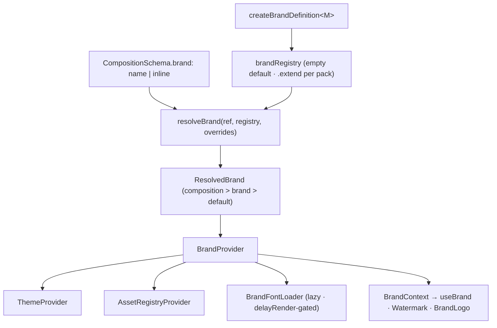

# ADR-004 — Brand System (typed brand packs on the registry kernel)

- **Status:** Accepted — pending Phase 17 implementation
- **Date:** 2026-07-17
- **Deciders:** Framework architecture
- **Related:** ADR-001 (registry kernel), ADR-002 (transitions + capabilities), ADR-003 (asset
  engine + kits), the font provider (deterministic loading), the theme context (downward-wired).
  Lights up the empty `branding/` layer.

---

## 1. Context

Today a "brand" is theme-only: `BrandConfig = { name?, mode?, theme?: ThemeOverrides, mark?:
AssetRef }` → `resolveBrand` → `{ name?, theme, mark? }`. Only **colors** are overridable and
`mark` is an unused raw string. Fonts load one **global** manifest at the entry (every render
loads the same families). The Phase-15 asset engine provides typed `AssetKit`s but nothing
*owns* one. The `branding/` layer is empty. Scenes take caller-built `ReactNode` slots.

## 2. Problem

Provide a typed, config-driven, **selectable brand pack** that aggregates everything a brand
owns — identity, theme mode + token overrides, typography families + loaded font faces, an asset
kit (primary/alternate logo, watermark), default scene surface, motion personality, default
transition, CTA treatment, layout preferences, optional audio identity, and social/legal
metadata — usable without modifying the core and safe for a future AI Director.

## 3. Alternatives considered

- **A. Keep inline `BrandConfig` + per-composition wiring.** Low effort, but a brand can't be
  packaged, named, reused, or selected; fonts/assets/motion stay ad-hoc; an AI Director has no
  brand vocabulary. Hidden debt as brands multiply.
- **B. A typed `brandRegistry` of `BrandDefinition`s referencing an `AssetKit`, with lazy
  per-brand fonts and a composing `BrandProvider` (chosen).** The fourth instance of the
  framework's registry + provider + context pattern.

## 4. Decision

A **brand pack** is a `BrandDefinition` — the fourth typed registry family. It aggregates theme,
fonts, an asset kit, and motion/transition/CTA/layout/audio defaults + metadata. Compositions
**select a brand by name**; the engine resolves it, merges with composition-level overrides,
loads its fonts lazily, and provides it via a richer `BrandProvider` that composes the existing
theme + asset providers. `BrandThemeProvider` (theme-only) is unchanged, so current configs keep
working.



### 4.1 Type relationships

```ts
// Generic over the asset kit's map M for typed logo/audio names.
type BrandDefinition<M extends AssetMap = AssetMap> = {
  name: string;
  mode?: ThemeMode;
  theme?: ThemeOverrides;                                   // colors today (broaden later — T2)
  fonts?: FontFace[];                                       // this brand's manifest (lazy-loaded)
  assets?: AssetKit<M>;
  logos?: {
    primary?:   NamesOfCategory<M, "image" | "svg">;        // compile-time category safety
    alternate?: NamesOfCategory<M, "image" | "svg">;
    watermark?: NamesOfCategory<M, "image" | "svg">;
  };
  surface?: { default?: ColorToken; opaqueByDefault?: boolean };
  motion?: { easing?: EasingToken; durationScale?: number; stagger?: number };
  transition?: TransitionConfig;
  cta?: { uppercase?: boolean; weight?: FontWeightToken; letterSpacing?: LetterSpacingToken };
  layout?: { safeArea?: SafeAreaToken; align?: Alignment; maxWidth?: number };
  audio?: { music?: NamesOfCategory<M, "audio">; sfx?: Record<string, NamesOfCategory<M, "audio">> };
  meta?: { handles?: Record<string, string>; legal?: string; url?: string };
};

const createBrandDefinition: <M extends AssetMap>(spec: BrandDefinition<M>) => BrandDefinition<M>;

type BrandMap = Record<string, BrandDefinition>;
type BrandRegistry = { require(name: string): BrandDefinition; has(name: string): boolean; keys(): string[] }; // erased (mirrors SceneResolver/AssetRegistry)

type ResolvedBrand = {
  name?: string;
  theme: Theme;                                             // concrete (mode + overrides merged)
  fonts?: FontFace[];
  assets?: AssetRegistry;                                   // erased kit registry
  logos?: { primary?: string; alternate?: string; watermark?: string };
  surface?: { default?: ColorToken; opaqueByDefault?: boolean };
  motion?: { easing?: EasingToken; durationScale?: number; stagger?: number };
  transition?: TransitionConfig;
  cta?: BrandDefinition["cta"];
  layout?: BrandDefinition["layout"];
  audio?: { music?: string };
  meta?: BrandDefinition["meta"];
};
```

A brand **references an `AssetKit<M>`** (it carries both the typed names *and* the renderers to
produce logo nodes); logo/watermark fields are typed **asset names** filtered to `image | svg`.
A typo (`logos.primary: "themeMusic"`) is a compile error.

### 4.2 Public API

```ts
const acmeKit = createAssetKit({
  logoPrimary: createAssetDefinition({ category: "svg", source: "acme/logo.svg" }),
  watermark:   createAssetDefinition({ category: "svg", source: "acme/wm.svg" }),
  themeMusic:  createAssetDefinition({ category: "audio", source: "acme/bed.mp3" }),
});

export const acme = createBrandDefinition({
  name: "Acme", mode: "dark",
  theme: { colors: { accent: "#00E0C6" } },
  fonts: [{ family: "Inter", weights: [400, 600], styles: ["normal"], subsets: ["latin"] }],
  assets: acmeKit,
  logos: { primary: "logoPrimary", watermark: "watermark" },   // typed to image|svg names
  transition: { type: "dissolve", duration: 0.5 },
  cta: { uppercase: true, letterSpacing: "wide" },
  audio: { music: "themeMusic" },
  meta: { handles: { instagram: "@acme" }, legal: "© Acme 2026" },
});
export const brands = createRegistry({ acme });

buildComposition({ id: "Promo", brand: "acme", scenes: [...] }, sceneRegistry, transitionRegistry, assetRegistry, brands);

<Watermark />                      // active brand's watermark, safe-area aware
<BrandLogo variant="primary" />    // active brand's logo

buildComposition({ id, brand: { mode: "dark", theme: { colors: { accent: "#fff" } } }, scenes: [...] }); // inline BrandConfig — back-compat
```

### 4.3 Registry design

`brandRegistry = createRegistry({})` — empty default (framework ships no brands). Packs via
`createRegistry(brands)` / `.extend(...)`. `createBrandDefinition<M>` captures the kit map for
typed logos/audio. `buildComposition` gains an optional 5th `brands` param via a permissive
overload — existing calls unchanged (mirrors Phase 15's `assets`). Identical recipe to ADR-001
§6; multiple packs need no core edit.

### 4.4 Font-loading strategy

Base manifest stays at the entry (deterministic default). Each brand carries `fonts?:
FontFace[]`; the `BrandProvider` renders a **`BrandFontLoader`** that calls
`fontProvider.load(brand.fonts)` (idempotent) **when that composition renders** — so only
rendered brands load their fonts, still gated by `delayRender` (deterministic). A per-brand
coverage test (mirroring `fonts.test.ts`) ensures each brand's manifest covers its typography.

### 4.5 Asset integration

A brand owns an `AssetKit`; logos/watermark/audio are typed names within it. `BrandProvider`
wraps `AssetRegistryProvider(brand.assets.registry)` + a `BrandContext` carrying resolved logo
names. **Logos become nodes** via `branding/` components reading the context (`<BrandLogo
variant>`, `<Watermark>`), which authors drop into scene slots — scenes never learn the source.

### 4.6 Merge & override rules

Precedence **composition-level > brand-level > framework default**:

| Field | Resolution |
|---|---|
| theme mode | composition › brand `mode` › `"light"` |
| theme overrides | base(mode) ← brand `theme` ← composition overrides |
| default transition | `composition.transitions` ?? brand `transition` ?? `{ type: "none" }` |
| scene surface | `scene.surface` ?? brand `surface.default` ?? `"background"` |
| fonts | base ∪ brand `fonts` (lazy) |
| motion / cta / layout | brand defaults, overridable (needs consumer context — §4.7) |
| logos / watermark / audio | brand-provided; composition/scene may override with a node |
| metadata | brand-provided (via `useBrand()`) |

### 4.7 Wire-now vs wire-later (scope honesty)

- **Wired in the Phase-17 MVP:** theme, assets/logos/watermark, default transition, fonts,
  metadata, brand-by-name selection.
- **Represented now, consumed in scoped follow-ups (a T1-style context wiring):** motion
  personality, CTA treatment, surface/layout defaults — each requires the consumer (motion
  primitives, `CTA`, `SceneFrame`) to read a brand-defaults context, exactly as theme wiring did
  in Phase 10A.

### 4.8 Serialization boundary & AI Director

The Director works in **names** (`{ brand: "acme", … }` — JSON-serializable). ReactNode-producing
pieces (asset renderers, logos) live in **code** (brand packs); the Director never emits
ReactNodes. Brand/asset/transition compatibility is expressed via metadata + the ADR-002 opacity
contract and validated **before render**. Compile-time brand-name selection (typed config)
requires threading the brand-map generic through `buildComposition`; MVP **runtime-validates**
the name (consistent with Phase 15's `music.asset`), typed selection deferred.

## 5. Dependency impact

- **New layer `src/brand/`** — `BrandDefinition`, `createBrandDefinition`, `brandRegistry`,
  `resolveBrand` (merge), `BrandProvider`, `useBrand`, `BrandFontLoader`. Depends **downward** on
  `config`, `config/fonts`, `assets`, `transitions`, `registry`.
- **`composition`** — resolves the brand (name → pack → merged), wraps `BrandProvider`, merges
  the default transition, loads fonts lazily; optional `brands` param. `resolveBrand` (legacy) /
  `BrandThemeProvider` retained.
- **`branding/`** — `<BrandLogo>`, `<Watermark>`, `<Endcard>` (consumer components).
- **Scenes — unchanged** (node slots). No upward edges; no cycles.

## 6. Backward compatibility

`CompositionSchema.brand: BrandConfig | string` (string = registered name; object = inline
legacy). `BrandThemeProvider` unchanged; the new `BrandProvider` composes it. Existing configs
and the demo render **byte-identical** without a brand pack.

## 7. Migration plan (Phase 17 = brand core)

1. `src/brand/` — definitions, registry, `resolveBrand` merge, `BrandProvider`, `useBrand`,
   `BrandFontLoader`.
2. Schema + builder — `brand: BrandConfig | string`, resolution + merge + lazy fonts + optional
   `brands` param; back-compat retained.
3. `branding/` components — `<BrandLogo>`, `<Watermark>`, `<Endcard>`.
4. Tests + a sample brand-pack fixture + render verification.

**Deferred:** motion/CTA/surface/layout consumer-context wiring, typography-override broadening
(T2), typed brand-name config, endcard/legal-footer polish, per-brand SFX.

## 8. Risks

| Risk | Severity | Mitigation |
|---|---|---|
| Font lazy-loading shifts to render-time | Medium | Reuse font provider + `delayRender` gating; base fonts at entry; per-brand coverage tests. |
| Motion/CTA/surface defaults need consumer wiring | Medium | Represent now, wire in scoped follow-ups (T1 precedent). |
| Brand-name config runtime-validated in MVP | Low | Kit/registry give authoring-time safety; typed config is a documented future. |
| `BrandDefinition` breadth (scope creep) | Medium | MVP wires a subset; rest are typed-but-deferred. |
| Back-compat regressions | Low | `BrandConfig`/`resolveBrand`/`BrandThemeProvider` retained; `brand` is a widening union; demo byte-identical. |

## 9. Testing strategy

- **Pure:** `resolveBrand` merge (mode/theme/transition, precedence), brand registry, per-brand
  font coverage, logo-name → node resolution.
- **Type:** `createBrandDefinition` inference — `logos.primary` accepts only image|svg kit names;
  `@ts-expect-error` for wrong/audio names; `audio.music` only audio names.
- **Structural:** `BrandProvider` wraps theme + asset + font-loader + brand context;
  `<BrandLogo>`/`<Watermark>` resolve to the right asset `src`; default transition merged.
- **Render:** brand pack applied → recolored + logo + brand fonts; **byte-diff vs no-brand**;
  demo unchanged; a second brand differs; lazy-load asserts only the selected brand's manifest.

## 10. Future extension points

Motion/CTA/surface/layout consumer-context wiring; typography-override broadening (T2); typed
brand-name config via generic threading; endcard + legal-footer components; per-brand SFX;
brand-compatibility metadata for the AI Director.
