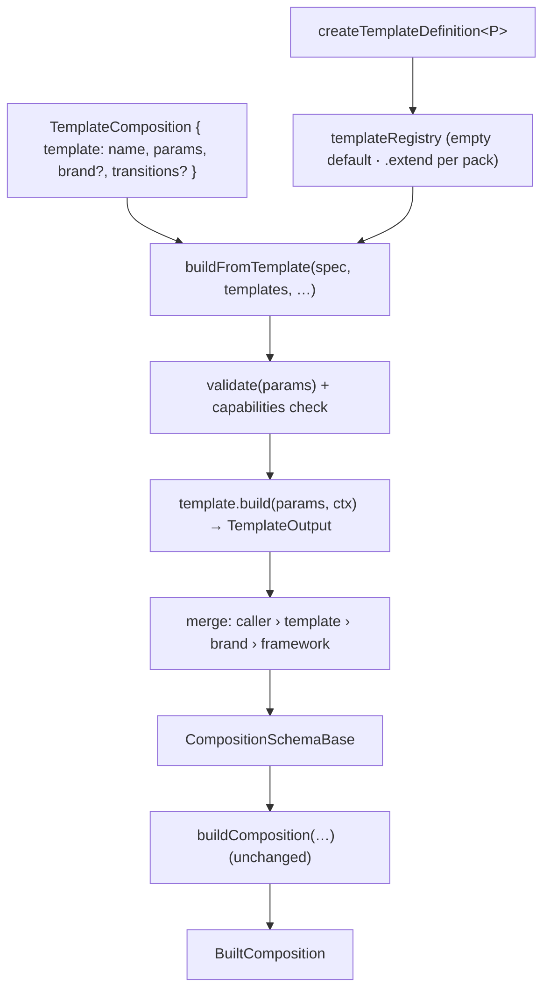

# ADR-005 — Template Engine (typed template packs on the registry kernel)

- **Status:** Accepted — pending Phase 19 implementation
- **Date:** 2026-07-18
- **Deciders:** Framework architecture
- **Related:** ADR-001 (registry kernel + typed family recipe), ADR-002 (transitions +
  capabilities — the capabilities precedent), ADR-003 (asset engine + kits), ADR-004 (brand
  system + name-selection + precedence). The registry kernel already names templates as a planned
  family; this is the fifth instance of the pattern.

---

## 1. Context

Authoring a video today means hand-writing a full `CompositionSchema`: every scene, every prop,
every duration, and the transition choreography spelled out explicitly. `buildComposition`
validates and assembles that schema into a `<Composition>`-ready descriptor, resolving brand,
timeline, and providers. There is no way to package a *kind* of video (a "product launch", a
"quote reel") so it can be reused across different content — and nothing decouples *what the video
says* (content) from *how it is structured* (presentation). The `registry.ts` kernel doc already
lists "templates later" as an anticipated family; the recipe (Definition + `create*Definition<T>`
+ `createRegistry` + erased resolver) is established across scenes, transitions, assets, and
brands.

## 2. Problem

Provide a typed, config-driven, **selectable template pack** that captures the structure and
choreography of a reusable video kind and exposes a small, **serializable parameter surface**
(content slots + options). Supplying params + a brand must produce a full composition through the
**existing** builder — no duplication of timeline, brand-merge, or provider logic — and the whole
invocation (`{ template, params, brand }`) must stay JSON so a future AI Director can emit it
without ever producing React.

## 3. Alternatives considered

- **A. Template = a saved `CompositionSchema` constant** (no params). Trivial, but it is just a
  frozen config: no reuse across content, no content/presentation split.
- **B. Template as a React component** that renders scenes directly. Bypasses the builder
  (timeline parity, brand merge, providers), and breaks the name-selected serialization boundary —
  the Director would have to emit ReactNodes.
- **C. A `template` field inside `CompositionSchema`** (`scenes` XOR `template`). Creates an
  ambiguous union, complicates the erased base type and `validateComposition`.
- **D. Templates emit a `BuiltComposition` directly** (own their assembly). Duplicates
  timeline/provider logic and drifts from the single assembly path.
- **E. A typed `templateRegistry` of `TemplateDefinition`s whose pure `build` emits a
  `CompositionSchema` fragment, assembled by the existing `buildComposition` (chosen).** The fifth
  instance of the framework's registry family pattern; adds a layer *above* the Composition Engine
  with zero builder changes.

## 4. Decision

A **template pack** is a `TemplateDefinition` — the fifth typed registry family. It is a pure
function from typed **params** to a **`TemplateOutput`** (a `CompositionSchema` fragment: scenes +
optional default choreography), plus a declarative **`capabilities`** descriptor and human-facing
**`meta`**. A `TemplateComposition` selects a template **by name**, supplies its params, and may
override caller-level defaults; `buildFromTemplate` resolves the template, validates params, runs
`build`, merges under a fixed precedence, and **delegates to `buildComposition`**. Templates never
produce React — only configuration.



### 4.1 Type relationships

```ts
// Serializable content/options — the JSON a caller (or AI Director) fills.
type TemplateParams = Record<string, unknown>;

// Read-only context the builder passes down — resolved canvas + brand NAME, never the React tree.
type TemplateContext = { width: number; height: number; fps: number; brand?: string };

// The config fragment a template emits — NOT a React tree. (Renamed from TemplateResult.)
type TemplateOutput = {
  scenes: SceneConfigBase[];
  transitions?: TransitionConfigBase;   // the template's default choreography
  timing?: TimingConfig;
  music?: MusicConfig;                   // template may wire music by name
  assets?: AssetCatalog;
};

// Declarative, static description read WITHOUT executing build() — mirrors ADR-002 transition
// capabilities. Distinct from meta (which is human-facing). Enables pre-render reasoning by the
// engine, tooling, and the AI Director.
type TemplateCapabilities = {
  formats?: FormatName[];        // designed-for formats; undefined = format-agnostic
  variableLength?: boolean;      // total duration depends on params (e.g. a list slot)
  requiresBrand?: boolean;       // renders correctly only with an active brand
  providesTransitions?: boolean; // emits its own default transition choreography
  providesMusic?: boolean;       // wires its own music track (caller music overrides)
  minScenes?: number;            // bounds on emitted scene count (validation/tooling)
  maxScenes?: number;
};

// A template pack, generic over its param type P for compile-time authoring safety.
type TemplateDefinition<P extends TemplateParams = TemplateParams> = {
  name: string;
  format?: FormatName;                              // default canvas the template targets
  capabilities?: TemplateCapabilities;              // static, declarative (§4)
  validate?: (params: P) => void;                   // structural param validation; no Zod
  build: (params: P, ctx: TemplateContext) => TemplateOutput;   // PURE — config, never React
  meta?: { description?: string; category?: string; previewParams?: P };  // human-facing only
};

const createTemplateDefinition: <P extends TemplateParams>(spec: TemplateDefinition<P>) => TemplateDefinition<P>;

type TemplateMap = Record<string, TemplateDefinition>;
type TemplateResolver = { require(name: string): TemplateDefinition<any>; has(name: string): boolean; keys(): string[] }; // erased (mirrors SceneResolver / BrandRegistry)

// A template-driven composition — kept SEPARATE from CompositionSchema (Alt C rejected).
type TemplateComposition<P = TemplateParams> = VideoConfigInput & {
  id: string;
  template: string;
  params: P;
  brand?: BrandConfig | string;
  theme?: ThemeMode;
  transitions?: TransitionConfig;   // caller override of the template's default
  music?: MusicConfig;              // caller override
  timing?: TimingConfig;
};
```

`capabilities` and `meta` are deliberately separate: `capabilities` is machine-read, declarative,
and drives validation/compatibility decisions before render; `meta` is descriptive prose for
humans and Studio. `build` returns configuration only — the single assembly path (timeline
parity, brand merge, providers) stays wholly owned by `buildComposition`.

### 4.2 Public API

```ts
const productLaunch = createTemplateDefinition({
  name: "product-launch",
  format: "horizontal",
  capabilities: { formats: ["horizontal", "square"], variableLength: true, providesTransitions: true, requiresBrand: false },
  validate: (p) => { if (!p.productName) throw new Error("product-launch: `productName` is required."); },
  build: (p, ctx) => ({
    scenes: [
      { scene: "hero", duration: 2.5, props: { title: p.productName, subtitle: p.tagline } },
      ...p.features.map((f) => ({ scene: "feature", duration: 2, props: { title: f.title, body: f.body } })),
      { scene: "logo-reveal", duration: 2, props: { tagline: p.ctaText } },
    ],
    transitions: { type: "dissolve", duration: 0.5 },
    ...(p.music ? { music: { asset: p.music } } : {}),
  }),
  meta: { description: "Hero → feature run → CTA.", category: "marketing" },
});

export const templates = createRegistry({ "product-launch": productLaunch });

// Typed: params inferred from the concrete registry (mirrors buildComposition<M>(config, scenes)).
buildFromTemplate(
  { id: "LaunchQ3", template: "product-launch", brand: "midnight",
    params: { productName: "Nova", tagline: "Ship faster", features: [{ title: "Fast" }, { title: "Typed" }] } },
  templates,
);
```

### 4.3 Registry design

`templateRegistry = createRegistry({})` — empty default; **the framework ships no templates**
(no business content). Packs populate their own via `createRegistry(...)` / `.extend(...)`.
`createTemplateDefinition<P>` captures `P` so a `TemplateComposition`'s `params` are compile-time
typed at the call site; the erased `TemplateResolver` (`require → TemplateDefinition<any>`) lets
concrete param-typed registries remain assignable — the same erasure that brand kits required
(ADR-004 §4.3). `buildFromTemplate` accepts optional `templates / scenes / transitions / assets /
brands` registries via a permissive overload, defaulting to the built-ins.

### 4.4 Build & merge pipeline

1. Resolve the template by name (`templates.require`).
2. Assemble `TemplateContext` from the resolved `VideoConfig` (width/height/fps) + brand name.
3. Run `validate(params)` (if present) and the `capabilities` pre-checks (§4.6).
4. Call `build(params, ctx)` → `TemplateOutput`.
5. Merge into a `CompositionSchemaBase` under the precedence in §4.5.
6. Hand to `buildComposition(schema, scenes, transitions, assets, brands)` — unchanged.

`build` is **pure**: no frame reads, no side effects, deterministic for given params (a render
requirement and a testability guarantee).

### 4.5 Precedence rules

The template inserts one layer into the Phase-17 transition chain. The full order is:

```
scene.transition  >  caller.transitions  >  template default  >  brand.transition  >  framework default
```

| Field | Resolution |
|---|---|
| per-scene transition | `scene.transition` (always wins) |
| default transition | `caller.transitions` ?? `template.transitions` ?? `brand.transition` ?? `{ type: "none" }` |
| music | `caller.music` ?? `template.music` (by name) |
| timing | `caller.timing` ?? `template.timing` |
| assets catalog | `caller` ∪ `template` (caller keys win) |
| brand / theme | passed through to `buildComposition` (brand merge unchanged from ADR-004) |
| content params | caller-supplied only (no merge) |

### 4.6 Capabilities & pre-render checks

`capabilities` is read *before* `build` runs, so tooling and the engine reason about a template
without executing it:

- `requiresBrand: true` + no `brand` on the `TemplateComposition` → validation error.
- caller `format` (or the template's) not in a non-empty `capabilities.formats` → validation
  error (or a documented warning).
- `minScenes` / `maxScenes` bound the emitted `scenes.length` — a structural post-`build` check.
- `variableLength` / `providesTransitions` / `providesMusic` are informational for tooling and the
  Director (e.g. "this template already wires music, caller music will override").

This mirrors ADR-002, where transition `capabilities` (affectsEntering/Exiting,
requiresOpaqueIncoming) drive the timeline's opacity contract without running the transition.

### 4.7 Wire-now vs wire-later (scope honesty)

- **Wired in the Phase-19 MVP:** `TemplateDefinition<P>` (incl. `capabilities` + `meta`),
  `createTemplateDefinition`, empty `templateRegistry`, `TemplateResolver`, `TemplateComposition`,
  `buildFromTemplate` (delegating to the existing builder), `validate` hook, the full precedence
  merge, capabilities pre-checks, a **fixture** template in tests (not shipped) proving end-to-end
  parity + one render still.
- **Reserved, documented, NOT implemented in the MVP:** **lifecycle hooks** (`onResolve` /
  `beforeBuild` / `afterBuild` — a documented future extension only; §10), template
  composition/nesting & shared partials, slot-level scene-implementation overrides,
  `calculateMetadata`-driven dynamic duration + Zod Studio controls (the Rendering/Delivery
  milestone), JSON-schema emission from `P` for AI param validation, localization/responsive
  param variants, and any shipped template library (business content stays out of the framework).

### 4.8 Serialization boundary & AI Director

A `TemplateComposition` is **names + JSON params** (`{ template: "product-launch", params: {…},
brand: "midnight", music: "bed" }`) — fully serializable and Director-emittable. Template *code*
(which produces scene structure) lives in **packs**, exactly like scene/brand packs; the Director
never emits React. Asset references inside params are **names**, not nodes. `capabilities` gives
the Director a pre-render vocabulary for template selection (formats, brand requirement, variable
length). Compile-time param typing requires threading the template-map generic through
`buildFromTemplate`; the MVP provides the typed overload for the static case and
**runtime-validates** the name + params otherwise (consistent with ADR-004 §4.8).

## 5. Dependency impact

- **New layer `src/templates/`** — `TemplateDefinition`, `createTemplateDefinition`,
  `templateRegistry`, `buildFromTemplate`, the types above. Depends **downward** on `composition`
  (builder + schema types), `transitions`, `config` (formats/timing), `registry`. Sits **above**
  the Composition Engine in the layer order (… → composition → assets → brand → branding →
  **templates** → app).
- **`composition` — unchanged.** `buildComposition`, `CompositionSchema`, `validateComposition`,
  and the timeline are untouched; templates only *produce* schemas for them.
- **No upward edges; no cycles.**

## 6. Backward compatibility

Purely additive. `CompositionSchema` and `buildComposition` are unchanged; `TemplateComposition`
and `buildFromTemplate` are a new, opt-in surface. Nothing consumes templates by default, so the
demo and all existing configs render **byte-identical**.

## 7. Migration plan (Phase 19 = template core)

1. `src/templates/` — types (`TemplateDefinition<P>`, `TemplateParams`, `TemplateContext`,
   `TemplateOutput`, `TemplateCapabilities`, `TemplateMap`, `TemplateResolver`,
   `TemplateComposition`), `createTemplateDefinition`, empty `templateRegistry`.
2. `buildFromTemplate` — resolve, validate + capabilities check, `build`, precedence merge,
   delegate to `buildComposition`; permissive overload for custom registries + typed overload for
   inferred params.
3. Barrel export from `src/templates/index.ts`; re-export from `composition` if ergonomic.
4. Tests + a fixture template (not shipped) + render verification.

**Deferred:** lifecycle hooks, nesting/partials, slot overrides, `calculateMetadata`/Zod controls,
`P`-schema emission, localization, a shipped template library.

## 8. Risks

| Risk | Severity | Mitigation |
|---|---|---|
| Param-type erasure at the registry boundary | Low | `TemplateDefinition<any>` erased resolver + `createTemplateDefinition<P>` authoring; the already-solved brand-kit invariance pattern. |
| Precedence creep (a fourth default layer) | Medium | Fixed order documented in §4.5 and covered by an end-to-end precedence test. |
| Two authoring surfaces (`CompositionSchema` vs `TemplateComposition`) | Medium | Shared underlying types; templates are opt-in; documented. |
| Scope temptation to ship a template library | Medium | Framework ships zero templates; MVP proves the engine with a test-only fixture. |
| `build` impurity (frame reads / side effects) | Low | Contract requires purity; fixture parity + determinism tests enforce it. |
| Capabilities drifting into runtime behavior | Low | Capabilities are declarative/pre-render only; behavior stays in `build` + the builder. |

## 9. Testing strategy

- **Pure:** `buildFromTemplate` end-to-end parity (a fixture template's `durationInFrames` + scene
  tree equals the hand-written equivalent); precedence (caller › template › brand › framework;
  scene still wins); `validate` throws on missing required content; capabilities pre-checks
  (`requiresBrand` without a brand, format mismatch, scene-count bounds).
- **Type:** `createTemplateDefinition<P>` param inference — `params` typed at the call site;
  `@ts-expect-error` for wrong/missing param types; erased-resolver assignability of a concrete
  param-typed registry.
- **Structural:** merged `CompositionSchemaBase` shape; `capabilities`/`meta` separation preserved.
- **Render:** a fixture-template composition renders a still; **demo byte-identical** (no template).

## 10. Future extension points

**Lifecycle hooks** (`onResolve` / `beforeBuild` / `afterBuild`) — reserved here as the primary
documented extension, intentionally unimplemented in the MVP; template composition/nesting +
shared partials; slot-level scene-implementation overrides; `calculateMetadata`-driven dynamic
duration + Zod-parameterized Studio controls (Rendering/Delivery milestone); JSON-schema emission
from `P` for AI-Director param validation; localization/responsive param variants; a
compatibility vocabulary linking template `capabilities` to brand/scene metadata.
