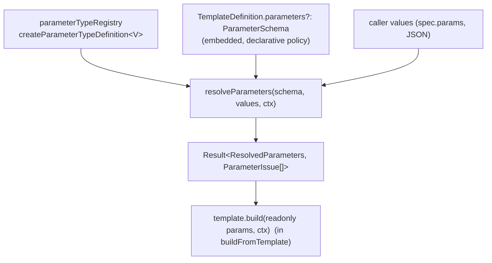

# ADR-006 — Parameter Engine (declarative, serializable template parameters)

- **Status:** Accepted — pending Phase 21 implementation
- **Date:** 2026-07-18
- **Deciders:** Framework architecture
- **Related:** ADR-001 (registry kernel + typed family recipe), ADR-002 (capabilities precedent),
  ADR-003 (asset engine + name selection), ADR-004 (brand system + name selection), ADR-005
  (template engine — the consumer of parameters). The registry kernel's family recipe is reused
  for the parameter *type* vocabulary; the serialization boundary (code-behind-a-name) is reused
  for validators.

---

## 1. Context

A template's inputs today are an opaque generic `P extends TemplateParams` plus an optional
**imperative** `validate?: (params: P) => void` closure (ADR-005 §4.1). TypeScript erases `P` at
runtime, so the framework cannot answer "what does this template accept?" There is no defaults
engine, no declarative validation, and no machine-readable description that an AI Director, a web
form, Remotion Studio, a CLI, or a REST endpoint could read. Every template hand-rolls
`p.body ?? ""` and ad-hoc `if (!p.title) throw`.

## 2. Problem

Provide a **declarative, serializable, React-independent, validated** description of a template's
parameters: self-describing (types + constraints + defaults + metadata), enforced uniformly, and
consumable by many surfaces without touching React — while preserving the JSON `{ template,
params }` boundary an AI Director emits.

## 3. Alternatives considered

- **A. Keep the raw `P` + imperative `validate`.** Zero new surface, but no introspection, no
  defaults engine, no shared vocabulary; each surface re-describes params.
- **B. Parameters as a global registry family** (a `parameterRegistry` of individually-named
  `ParameterDefinition`s). Rejected: a single parameter is not independently selectable the way a
  scene or brand is — it only has meaning inside its template. A registry whose entries are never
  selected by name is a false parallel to the other families.
- **C. Adopt Zod.** A runtime dependency that couples the schema to a library, undermines the
  JSON/AI-Director boundary (Zod schemas aren't serializable), and contradicts the framework's
  standing no-Zod, structural-validation stance.
- **D. Hybrid — a `ParameterType` registry family + an embedded `ParameterSchema` + a pure
  `ParameterResolver` (chosen).** The parameter *type vocabulary* is the fifth-recipe registry
  (Definition + Registry + erased Resolver); each template's *schema* is embedded declarative
  policy; a pure resolver folds caller values + defaults + validation into immutable
  `ResolvedParameters`. Fully serializable, React-free, no new dependency.

## 4. Decision



### 4.1 Type registry vs embedded schema (the split)

- The **parameter *type* vocabulary is a registry family**: `parameterTypeRegistry` of
  `ParameterTypeDefinition`s, extended via `createRegistry(...)` / `.extend(...)`, resolved through
  an **erased** `ParameterTypeResolver` (`require → ParameterTypeDefinition<any>`) — identical to
  scenes/transitions/assets/brands.
- Each template's **`ParameterSchema` stays embedded** in `TemplateDefinition` (new optional
  `parameters?`), replacing the imperative `validate`.

### 4.2 Strict behavior/policy separation

`ParameterTypeDefinition` describes **HOW a value behaves** — nothing template-specific. It must
never accumulate policy (no per-template defaults, labels, or min/max on the type).
`ParameterDefinition` describes **HOW THIS TEMPLATE USES THAT TYPE** — required, default,
constraints, conditions, metadata, ui.

```ts
// BEHAVIOR ONLY — the registry family.
type ParameterTypeDefinition<V = unknown> = {
  name: string;
  parse: (raw: unknown, def: ParameterDefinition, ctx: ParameterContext) => V;                 // JSON → typed value
  validate?: (value: V, def: ParameterDefinition, ctx: ParameterContext, issues: ParameterIssue[], path: string) => void;
  serialize?: (value: V) => ParameterValue;                                                     // typed value → JSON
  ui?: ParameterUIHints;                                                                        // DEFAULT hints (overridable)
  capabilities?: ParameterCapabilities;                                                         // machine-read
};
// eslint-disable-next-line @typescript-eslint/no-explicit-any
type ParameterTypeMap = Record<string, ParameterTypeDefinition<any>>;
type ParameterTypeResolver = { require(name: string): ParameterTypeDefinition<any>; has(n: string): boolean; keys(): string[] };
const createParameterTypeDefinition: <V>(spec: ParameterTypeDefinition<V>) => ParameterTypeDefinition<V>;
const parameterTypeRegistry: Registry<ParameterTypeMap>;   // built-in types (§4.4)
```

### 4.3 Type relationships (policy grouped into nested objects — no "fat" definition)

```ts
type ParameterValue = string | number | boolean | null | ParameterValue[] | { [k: string]: ParameterValue };

type ParameterTypeName =
  | "string" | "text" | "number" | "boolean" | "enum" | "color"
  | "image" | "video" | "audio" | "brand" | "date" | "url" | "list" | "group";   // reserved: "richText"

type EnumOption = { value: ParameterValue; label?: string; icon?: string };

type ParameterConstraints = {
  min?: number; max?: number; step?: number;         // number / date bound / string-length / list-length
  pattern?: string;                                  // regex source (string / url)
  enum?: readonly ParameterValue[]; options?: EnumOption[];
  itemType?: ParameterTypeName;                      // list element type
  fields?: ParameterDefinition[];                    // group/object nested params (the ONLY value nesting)
  assetCategory?: AssetCategory;                     // image/video/audio → required category
};

// V1 condition model (declarative JSON). An expression AST is reserved for V2 (§12) — NOT implemented.
type ParameterCondition =
  | { key: string; equals: ParameterValue }
  | { key: string; in: ParameterValue[] }
  | { key: string; exists: boolean }
  | { all: ParameterCondition[] } | { any: ParameterCondition[] } | { not: ParameterCondition };
type ParameterConditions = { requiredWhen?: ParameterCondition; visibleWhen?: ParameterCondition };

type ParameterUIHints = {
  control?: "input" | "textarea" | "select" | "radio" | "switch" | "slider" | "colorPicker" | "assetPicker" | "datePicker" | "repeater";
  rows?: number; unit?: string; columns?: number; collapsible?: boolean;
};
type ParameterMetadata = {
  label?: string; description?: string; placeholder?: string; helpText?: string;
  group?: string;                                    // ParameterGroup id
  advanced?: boolean; order?: number; icon?: string;
};
type ParameterCapabilities = { localizable?: boolean; responsive?: boolean; computed?: boolean; aiGeneratable?: boolean };

// POLICY — how THIS template uses a type. Nested objects keep it lean + evolvable.
type ParameterDefinition = {
  key: string;
  type: ParameterTypeName;
  required?: boolean;
  default?: ParameterValue;
  validators?: string[];                             // NAMED refs (serializable) → validatorRegistry
  constraints?: ParameterConstraints;
  conditions?: ParameterConditions;
  metadata?: ParameterMetadata;
  ui?: ParameterUIHints;                             // overrides the type's default hints
  capabilities?: ParameterCapabilities;
};

// UI ORGANIZATION ONLY — never affects validation or the resolved value shape (§4.9).
type ParameterGroup = { id: string; label?: string; description?: string; order?: number; advanced?: boolean; parameters: string[] };

type ParameterSchema = {
  version?: number;
  parameters: ParameterDefinition[];                 // ordered
  groups?: ParameterGroup[];                         // optional UI sections
  capabilities?: ParameterCapabilities;
};
```

### 4.4 Parameter types (built-in vocabulary)

| Type | Value | Behavior notes (in the type, not the definition) |
|---|---|---|
| `string` | `string` | length via `min/max`; `pattern` |
| `text` | `string` | multiline; default ui `textarea` |
| `richText` *(reserved)* | `{ format, content }` | **future** — declared, not implemented |
| `number` | `number` | `min/max/step` |
| `boolean` | `boolean` | type default `false` |
| `enum` | member of `enum`/`options` | membership |
| `color` | `string` | hex/rgb/token grammar |
| `image`/`video`/`audio` | `string` (asset **name**) | existence + `assetCategory` match (§4.10) |
| `brand` | `string` (brand **name**) | existence (§4.10) |
| `date` | `string` (ISO-8601) | `min/max` ISO bounds |
| `url` | `string` | URL grammar; scheme allowlist via metadata |
| `list` | `ParameterValue[]` | `itemType`; length `min/max`; recursive |
| `group` | `{ [k]: ParameterValue }` | `fields`; recursive; the only value nesting |

### 4.5 Validation pipeline (explicit, ordered)

```
Raw JSON
  → Type parse            (type.parse: coerce/guard each provided value; shape issues)
  → Type validation       (type.validate: intrinsic validity — color/url/date grammar, asset/brand name)
  → Default resolution    (absent key ← parameter default ← type default)
  → Template constraints   (min/max/step/pattern/enum/options; list + group recursion)
  → Named validators      (validators[]: resolved by name from validatorRegistry)
  → Conditional rules     (requiredWhen/visibleWhen evaluated over the now-complete value set)
  → ResolvedParameters    (deeply readonly — §4.11)
```

Required enforcement is evaluated in the **conditional-rules** stage, because `requiredWhen` may
reference other keys and therefore needs all defaults resolved first. Each stage appends
`ParameterIssue`s; the pipeline is data-in/data-out with no side effects.

### 4.6 Issue model (rich, path-addressed)

```ts
type ParameterIssue = {
  path: string;                     // dotted + array-indexed, e.g. "features[2].title"
  code: string;                     // machine code, e.g. "required", "min", "pattern", "unknown-asset"
  severity: "error" | "warning";
  message: string;                  // human-readable
  expected?: unknown; actual?: unknown;
};
```
`path` (not `key`) scales to nested groups and list items; `severity` lets forms/AI show warnings
without failing; `expected`/`actual` power precise UI + AI feedback.

### 4.7 Resolver — Result-based engine + throwing helper

```ts
type Result<T, E> = { ok: true; value: T } | { ok: false; errors: E };

type ParameterResolver = {
  validate(schema: ParameterSchema, values: Record<string, ParameterValue>, ctx?: ParameterContext): ParameterIssue[];   // non-throwing
  resolve(schema: ParameterSchema, values: Record<string, ParameterValue>, ctx?: ParameterContext): Result<ResolvedParameters, ParameterIssue[]>;
  resolveOrThrow(schema: ParameterSchema, values: Record<string, ParameterValue>, ctx?: ParameterContext): ResolvedParameters;   // convenience
};
```

**Tradeoff.** The engine works internally with `Result` because it composes naturally for forms,
CLIs, and AI slot-filling (collect *all* issues; no control-flow-by-exception; pairs with
`validate()`). A throwing `resolveOrThrow` is provided for the build path, where an invalid
composition should fail fast (mirroring `validateComposition`). `buildFromTemplate` uses
`resolveOrThrow`; interactive surfaces use `resolve`/`validate`. Result-first keeps the core honest
and lets each caller pick its error discipline.

### 4.8 Conditions: V1 now, expression AST reserved (V2)

V1 ships the boolean/comparison model above (`equals | in | exists | all | any | not`) — enough for
show/require-when logic and fully JSON. A general **expression AST** (arithmetic, cross-parameter
references, functions) is **reserved for V2 and intentionally not implemented** (§12).

### 4.9 Groups are UI-only

`ParameterGroup` organizes parameters into sections for presentation (forms/Studio) and **must
never affect validation or the resolved value shape**. Value nesting belongs exclusively to
`ParameterDefinition.constraints.fields` (the `group` type). A group referencing a key changes
*where it renders*, never *whether/how it validates*.

### 4.10 Asset & brand validation — names only

The `image`/`video`/`audio` types verify **existence** (`ctx.assets.has(name)`) and **category
compatibility** (the definition's `category` discriminant). They do **not** call `resolveAsset`,
load bytes, or inspect asset `metadata` — the Asset Engine (ADR-003) owns all of that. The `brand`
type verifies **existence** only (`ctx.brands.has(name)`); the Brand Engine (ADR-004) owns brand
semantics. This keeps the parameter layer a pure validator of *references*, not a resolver.

### 4.11 Immutable resolved parameters

```ts
type DeepReadonly<T> = T extends (infer U)[] ? ReadonlyArray<DeepReadonly<U>>
  : T extends object ? { readonly [K in keyof T]: DeepReadonly<T[K]> } : T;
type ResolvedParameters = DeepReadonly<Record<string, ParameterValue>>;
```
`build()` receives deeply-readonly params and **must not mutate** them — a documented contract that
keeps template builds pure and deterministic (ADR-005 §4.4).

### 4.12 build() integration + precedence

`resolveTemplateComposition` (ADR-005) gains one step:
```ts
const params = template.parameters
  ? resolveParameters(template.parameters, spec.params, { assets, brands, format })   // Result → throw on errors
  : spec.params;                                                                       // legacy: raw P + imperative validate
template.validate?.(params);       // retained; runs after schema resolution when both exist
const output = template.build(params, ctx);
```

**Value precedence** (orthogonal to ADR-005's transition/music/timing precedence):
```
caller value  >  computed value (future)  >  parameter default  >  type default  >  (absent → required error)
```

### 4.13 Metadata vs capabilities

`metadata`/`ui` are human-/UI-facing and **inert** (never affect validation or rendering);
`capabilities` are machine-read, declarative, and future-facing. The split mirrors ADR-005 §4.1
and must be preserved.

### 4.14 Serialization boundary & the AI Director

The entire `ParameterSchema` — definitions, constraints, enum options, conditions, metadata, ui —
is **pure JSON**. The only non-serializable pieces are **code** (custom validators, later computed
expressions), referenced by **name** from `validatorRegistry` — the identical code-behind-a-name
boundary used for scenes/brands/templates. So `{ template, params }` stays JSON **and** the
template now publishes a machine-readable schema of what it accepts — the missing half of the AI
Director vocabulary (ADR-004 §4.8, ADR-005 §4.8). The schema becomes the **single source of truth**
for a future export chain: `ParameterSchema → JSON Schema → OpenAPI → Studio Controls → CLI → Web
Forms → AI Director` (§12).

## 5. Architectural boundaries (hard limits — the Parameter Engine validates data only)

The Parameter Engine does **NOT**, and must never:

- import or render **React** — no elements, no components (§6);
- create a **Context, Provider, or Hook** (§6);
- **load or resolve assets** — it checks a name's existence + category only (§4.10);
- **load or resolve brands** — it checks a name's existence only (§4.10);
- **render** anything or read frames;
- **execute templates** — it does not call `template.build`; it produces `ResolvedParameters` that
  `buildFromTemplate` (the Template Engine) passes to `build`;
- **assemble compositions** — it never touches `buildComposition`, the timeline, or the tree.

Its sole responsibility is: **schema + values → validated, immutable `ResolvedParameters` (or
issues)**. Everything else belongs to a layer that *consumes* the result.

## 6. No Provider, no React (a feature)

Unlike Theme, Assets, and Brand — which each install a Provider because they cross into the render
tree — **parameters are pre-render data**. `src/parameters/` therefore has **no Context, no
Provider, and no Hooks**, and imports no React. This is a deliberate design property, not an
omission: it keeps the engine usable from a CLI, a server, a test, or an AI loop with zero render
context.

## 7. Dependency impact (no cycles)

- **New layer `src/parameters/`** — types, `parameterTypeRegistry`, `createParameterTypeDefinition`,
  `resolveParameters`/`validateParameters`, empty `validatorRegistry`. Depends **downward** only on
  `registry` (kernel), `config` (`FormatName`), `assets` (`AssetCategory`, `AssetRegistry` **type**
  — for name checks), `brand` (`BrandRegistry` **type**). Imports **nothing** from `templates` or
  `composition`.
- **`templates`** adds an edge → `parameters` (optional `parameters?` on `TemplateDefinition`;
  `resolveTemplateComposition` calls `resolveParameters`).
- No back-edge exists (parameters needs only asset/brand *types* for reference validation, all in
  lower layers), so **no cycle**.

## 8. Backward compatibility

Purely additive. `TemplateDefinition.parameters?` is optional; templates without a schema keep the
raw `P` + imperative `validate` path unchanged. `buildComposition`, `CompositionSchema`, and
`buildFromTemplate`'s public surface are untouched. Nothing consumes parameters by default, so the
demo renders **byte-identical**.

## 9. Migration plan (Phase 21 = Parameter Engine Core)

1. `src/parameters/` — types (§4.3); `parameterTypeRegistry` with the built-in types (§4.4);
   `createParameterTypeDefinition`; `resolveParameters` (Result) + `resolveOrThrow` +
   `validateParameters`; empty `validatorRegistry`; barrel.
2. **Templates integration (additive):** `TemplateDefinition.parameters?: ParameterSchema`;
   `resolveTemplateComposition` runs `resolveParameters` when present and passes readonly resolved
   params to `build`; raw `P` + imperative `validate` retained.
3. Tests + fixture schemas (the framework ships **no** business schemas).
4. **Deferred:** computed parameters/expressions, expression-AST conditions (V2), localization,
   responsive variants, AI-generated defaults, JSON-Schema/OpenAPI export, Zod codegen, UI adapters
   (forms/Studio/CLI), lifecycle hooks, `InferParams<Schema>`.

## 10. Risks

| Risk | Severity | Mitigation |
|---|---|---|
| Serializability erosion via validator closures | Medium | Named `validatorRegistry` refs; any code closure excluded from the serialized schema + documented. |
| Param-type registry erasure/invariance | Low | `ParameterTypeDefinition<any>` erased resolver + typed `createParameterTypeDefinition` — the solved scenes/assets/brand pattern. |
| Type-vocabulary scope creep | Medium | MVP ships a curated set; `richText`/computed/etc. reserved. |
| Behavior/policy leakage onto the type | Medium | §4.2 forbids template policy on `ParameterTypeDefinition`; enforced by review + tests. |
| Two authoring modes (raw `P` vs schema) | Low | Schema is optional + additive; back-compat; demo byte-identical. |
| Over-abstraction | Medium | Declarative, lean, nested-object policy; no Provider, no React, no hooks in MVP. |
| Precedence confusion (params vs composition) | Low | Orthogonal axes, both documented + tested; computed deferred. |

## 11. Testing strategy

- **Pure:** `resolveParameters` (defaults, coercion, precedence caller > default > type-default),
  each type's `parse`/`validate`, constraints (required, min/max, step, pattern, enum, url/date/
  color, list/group recursion), asset/brand **name** validation against fixture registries,
  `requiredWhen`/`visibleWhen`, `validateParameters` issue reporting (paths, codes, severity),
  **serializability round-trip** (schema → `JSON.stringify`/`parse` → deep-equal), **immutability**
  (a `build` that mutates resolved params is rejected/frozen).
- **Type:** `createParameterTypeDefinition` inference; `@ts-expect-error` for malformed type defs;
  erased-resolver assignability; `DeepReadonly` prevents assignment.
- **Integration:** `buildFromTemplate` with a schema — defaults reach `build`, invalid caller
  values rejected, resolved params correct; **back-compat** (no-schema template unchanged; **demo
  byte-identical**).
- No render dependency (engine is pure).

## 12. Future extension points

- **Computed parameters / expressions** — a named `computeRegistry` (serializable ref) or the
  reserved **expression AST (V2)** for conditions/derivations; `capabilities.computed`.
- **Localization** — locale-keyed values + `ctx.locale`; `capabilities.localizable`.
- **Responsive variants** — format-keyed values + `ctx.format`; `capabilities.responsive`.
- **AI-generated defaults** — `capabilities.aiGeneratable` + a Director-fills hook.
- **Export chain** — `ParameterSchema → JSON Schema → OpenAPI → Studio Controls → CLI → Web Forms →
  AI Director`, each a pure adapter in its own layer; the schema is the single source of truth.
- **Zod generation** — schema → Zod **codegen**, opt-in, **never a runtime dependency**.
- **Lifecycle hooks** — **deferred** (consistent with ADR-005 §4.7): the declarative pipeline plus
  named validators/computes covers the need without reintroducing non-serializable imperative
  seams; revisit alongside the template lifecycle-hook decision.

## 13. Amendment (post-Phase 30) — parameter type names are a CLOSED vocabulary

**Status: Accepted.** This section corrects §4.1's extensibility claim and withdraws the reserved
surface listed in §13.4. It supersedes those points only — every decision not named here stands as
originally written (see §13.6). The original text is left intact as the historical record.

This amendment deliberately separates three different kinds of change:

| Kind | What it covers | Where |
|---|---|---|
| **Architecture correction** | The type-name vocabulary is closed, not open | §13.1–§13.3 |
| **Bookkeeping withdrawal** | Speculative surface with no named consumer | §13.4 |
| **Implementation debt** | Needs no ADR decision; recorded so it is not mistaken for design | §13.7 |

### 13.1 The correction: type NAMES are closed

§4.1 committed to an open vocabulary — parameter types are "`ParameterTypeDefinition`s, **extended
via `createRegistry(...)` / `.extend(...)`**". That is now **superseded**: the set of parameter type
*names* is closed and owned by the framework.

Parameter types are the compiler's **primitives**, not user-authored content. Scenes, transitions,
templates, brands, and assets are content — open registries, correctly. A parameter type is the
vocabulary that content is *described in terms of*. Uniformity of mechanism (`createRegistry`) led
the original design to treat these as the same kind of thing. They are not.

Four independent reasons:

1. **Closing preserves the only detector of a whole failure class.** `resolve.ts` short-circuits on
   an unsupplied parameter (`if (!provided) { …default…; continue; }`) *before* the
   `types.has(def.type)` check. A typo'd type name on any parameter that is not supplied is
   therefore **never caught at runtime — ever**. The closed union is the sole mechanism that
   catches it, and it catches it at authoring time.
2. **The JSON boundary bounds what a type can be.** `parse` starts from JSON, so every conceivable
   custom type is a *constrained primitive* — precisely what `constraints` + named validators
   already express declaratively, serializably, and without code.
3. **The vocabulary was never uniformly open.** `group` and `list` have structural semantics
   hardcoded in the resolver; a registered custom type can never participate in nesting. The open
   registry was already a partial fiction.
4. **No production consumer exists.** `parameterTypeRegistry.extend` appears nowhere outside tests.

**Withdrawn guidance.** Any documentation or example suggesting `parameterTypeRegistry.extend({
mySlug })` — or registering any *new* type name — is withdrawn. New validation semantics belong in
`validatorRegistry` + `constraints` (§13.5).

### 13.2 `parameterTypeRegistry` is retained — for substitution and reflection only

The registry stays, but its justification is restated, because the original one (extension) has been
rejected. It exists for exactly two purposes:

- **Substitution** — a host may replace a *built-in's behaviour* per execution (a stricter `color`
  parse, a locale-aware `date`) via `ExecutionContext.registries.parameterTypes`. This changes
  behaviour **without adding names**, so it survives the closed decision intact.
- **Reflection** — `metadata.describeParameterTypes` genuinely consumes `keys()` / `require()`.
  Removing the registry would make parameters the only family with no reflection.

If substitution proves unexercised by 1.0, collapsing the registry to a frozen map is the
simplification to revisit — it would remove `ParameterTypeMap`, `ParameterTypeResolver`,
`createParameterTypeDefinition`, and the `parameterTypes` plumbing through `FrameworkRegistries`.
That is noted as a future option, not a decision.

### 13.3 `ParameterTypeDefinition` is reduced to `{ name, parse, validate?, ui? }`

`parse` is the irreducible responsibility: JSON → trusted value. `ui` is declarative reflection
metadata, consistent with the `TemplateMetadata` precedent. `serialize` and `capabilities` are
withdrawn (§13.4).

**Intrinsic `validate` remains distinct from named validators, and must not be collapsed into them.**
The two share a signature but differ in **binding**, which is the architecturally meaningful part:

- A type's `validate` is **intrinsic and automatic** — *every* `color` parameter is hex-checked, and
  every `image` parameter is existence-checked, without the schema opting in. It expresses what it
  *means* to be a value of that type.
- A named validator is **extrinsic and opt-in** — it applies only where a `ParameterDefinition`
  lists it. It expresses what *this template* additionally demands.

This is a class invariant versus a call-site precondition. Collapsing intrinsic checks into named
validators would force every colour parameter to write `validators: ["color"]`, which is verbose,
easy to forget, and silently weakens validation when omitted. An earlier draft of this analysis
called them duplicates; that was wrong, and the distinction is recorded here so the redundancy is
not "simplified away" by a future reviewer.

### 13.4 Bookkeeping — reserved surface withdrawn (no named consumer)

The following was specified by this ADR but has **no implementation and no reader**. It is
**withdrawn, not deferred** — consistent with Invariant #7 ("reserve, don't build"). Each may be
reinstated the day a real consumer is named, at which point it should be designed against that
consumer rather than in advance.

| Surface | ADR reference | Evidence |
|---|---|---|
| `ParameterTypeDefinition.serialize` | §4.2 (line 80) | Implemented by **0 of 14** built-ins; never called |
| `ParameterCapabilities` | §4.13 (lines 82, 141, 151) | `localizable`/`responsive`/`computed`/`aiGeneratable` — 0 implementations; projected by metadata only |
| `ParameterSchema.groups` / `ParameterGroup` | §4.9 (line 150) | Never read by the resolver *or* metadata; a group may reference a nonexistent key with no diagnostic |
| `ParameterSchema.version` | §4.3 (line 148) | Never read; request versioning belongs to ADR-008's envelope |
| `ParameterContext.locale` | §4.2 | Threaded into `ExecutionEnvironment`; never read |
| `ParameterContext.format` | §4.2 | Passed by `execute`; no type or constraint reads it |

**Effect on §12.** The *ideas* in "Future extension points" (localization, responsive variants,
computed parameters, AI-generated defaults) remain legitimate future work. What is withdrawn is the
**pre-declared type surface** that anticipated them. When one is built, it brings its own fields.

### 13.5 Extensibility: validators + constraints; parameterized refs reserved

With type names closed, the sanctioned extensibility mechanisms are:

- **`constraints`** — declarative, parameterized, JSON-expressible (`min`/`max`/`step`/`pattern`/
  `enum`/`options`/`itemType`/`fields`/`assetCategory`). Preferred: no code, fully reflectable.
- **Named validators** — `validatorRegistry` refs for what constraints cannot express. Open by
  design, referenced by name, no closures, JSON-safe. This is the correct open registry.

**Known limitation, reserved.** `ParameterDefinition.validators` is `string[]` — names only, with no
arguments. A parameterized rule ("at most 5 words") therefore needs one registered validator per
configuration. Now that validators carry the primary extensibility role, this is the binding
constraint. **Parameterized validator references** (`{ name, options }`) are reserved as the
sanctioned next step **only if a real consumer appears** — and if extensibility pressure does
arrive, it must land here, not on reopening the type vocabulary.

### 13.6 Unchanged and still accepted

This amendment touches nothing else. The following remain as originally decided:

- **§4.2 behavior/policy separation** — only the *openness* claim in §4.1 is corrected; the split
  between `ParameterTypeDefinition` (behaviour) and `ParameterDefinition` (policy) stands.
- **§4.5 validation pipeline** — the explicit, ordered stages.
- **§4.6 issue model + §4.7 Result-based resolver** — path-addressed, severity-tagged diagnostics
  that collect *all* issues rather than failing fast.
- **§4.11 immutable resolved parameters** — deep-frozen output handed to `build()`.
- **§4.14 serialization boundary** — the JSON-first schema as the single source of truth; code
  referenced by name only.
- **§5 architectural boundaries and §6 no Provider / no React** — the Parameter Engine validates
  data only, imports no React, and remains pre-render. This is the cleanest boundary discipline in
  the framework and is unaffected.
- **§4.8 conditions (V1 now, expression AST reserved)**, **§4.10 asset/brand names-only validation**,
  and **§4.12 build() integration + precedence**.

A from-first-principles redesign of this engine, performed without reference to the existing code,
differed from the shipped architecture in only two structural ways: the closed vocabulary above, and
a single resolver entry point (§13.7). That is a strong result, and the reason this amendment
corrects rather than replaces ADR-006.

### 13.7 Implementation debt — recorded, not decided here

The following require **no architectural decision**. They are consequences or defects, listed so a
future reader does not mistake them for design intent. None is addressed by this amendment, and each
is deferred to a later phase:

1. **Duplicate vocabulary** — `ParameterTypeName` (hand-written union) and `BuiltinParameterTypeName`
   (derived from `builtinParameterTypes`) are two declarations of one truth. The cycle-free fix is to
   anchor the built-in map with `satisfies Record<ParameterTypeName, …>` so TypeScript enforces exact,
   exhaustive agreement.
2. **`resolveParametersOrThrow`** — an obsolete throwing helper whose only production caller
   (`resolveTemplateComposition`) was removed in Phase 30. **Removed in Phase 33** (it had survived
   only in its own test); the public resolver surface is now `validateParameters` + `resolveParameters`.
3. **The double validation pass** — `resolveTemplateParameters` calls `validateParameters` and then
   `resolveParameters`, running the full pipeline (and every named validator) **twice**, purely to
   split warnings from errors. The minimal design has one resolver returning value *and* issues.
4. **Defaults bypass validation** — an applied `default` skips type validation, constraints, and
   validators entirely. This is a genuine correctness defect and the sharpest single fix available in
   this layer; it is independent of everything above.
