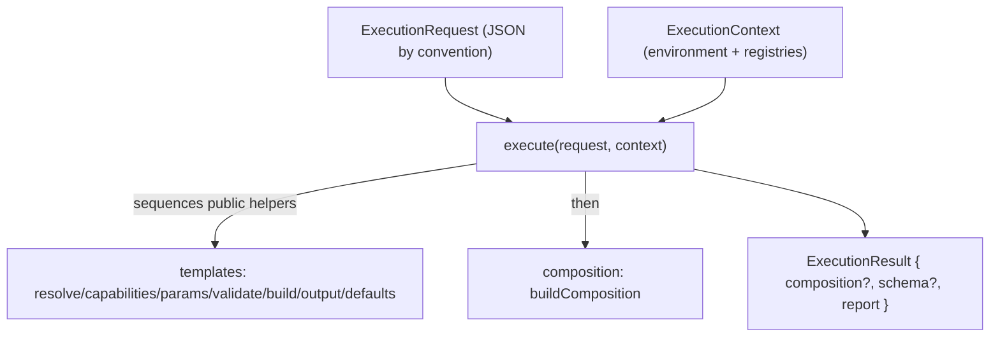
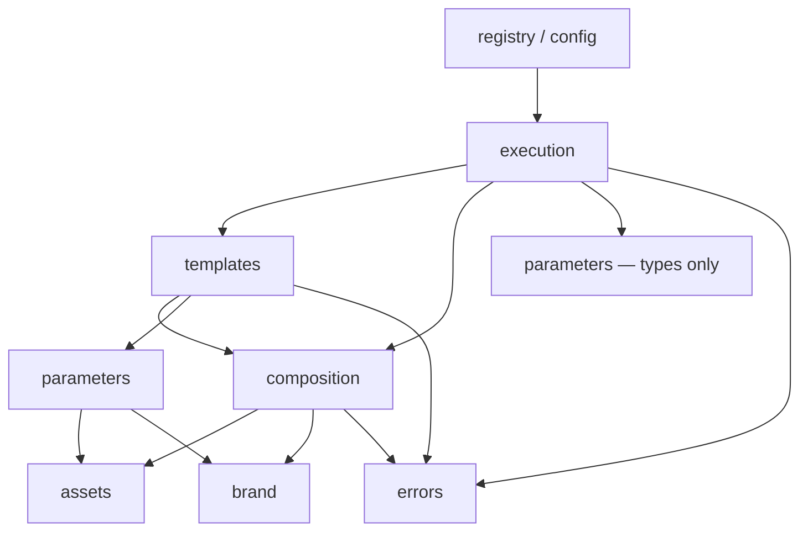

# ADR-007 — Lifecycle & Execution Engine (single orchestration implementation, cycle-free)

- **Status:** Accepted — pending Phase 23 implementation
- **Date:** 2026-07-18
- **Deciders:** Framework architecture
- **Related:** ADR-001 (registry kernel), ADR-002 (capabilities), ADR-003 (assets), ADR-004 (brand),
  ADR-005 (templates — `buildFromTemplate` / `resolveTemplateComposition`), ADR-006 (parameters —
  `resolveParameters` Result). This engine orchestrates those; it owns none of their semantics.

---

## 1. Context

Orchestration today is **implicit** inside `buildFromTemplate` (`resolveTemplateComposition` →
`buildComposition`). The model is **fail-fast**: the first problem throws a plain `Error`. The
Parameter Engine collects all issues internally (Result), but the boundary
(`resolveParametersOrThrow`) throws, discarding that benefit. There is no execution id, no stage
trace, no warnings channel, and no structured result an AI Director, Studio, or plugin can read.

## 2. Problem

Provide a single, **observable, diagnostic-rich orchestration boundary** that runs a template
through the existing engines and returns a structured result — while **owning none** of those
engines' logic, preserving every dependency direction (no cycles), and never letting React enter
the request / diagnostics / AI-observation contracts.

## 3. Alternatives considered

- **A. Keep `buildFromTemplate` as-is.** No diagnostics, no AI/plugin seam, fail-fast only.
- **B. Orchestrate inside `composition`.** Bloats the assembler and inverts the layer direction
  (composition would depend on templates/parameters).
- **C. Rewire `buildFromTemplate` to call `execute`.** **Rejected** — creates
  `templates → execution → templates`. A barrel re-export would only hide the cycle.
- **D. Shared pure helpers in `templates` + a dedicated `execution` layer with a Result boundary
  (chosen).** `execution` depends **downward** on `templates`' public helpers + `buildComposition`;
  `templates` never imports `execution`. One orchestration **implementation** (the shared helpers),
  two public entry points (`buildFromTemplate`, `execute`).

## 4. Decision

A new top layer **`src/execution/`** exposes `execute` (Result boundary) and `executeOrThrow`
(convenience). It sequences the existing engines' **public** pure helpers, threads an immutable
context, and produces an append-only, deterministic, JSON-safe `ExecutionReport`.



### 4.1 Layer placement, shared helpers, two entry points

The stage logic that lives inside `resolveTemplateComposition` today is **exposed as public,
documented pure helpers of the `templates` engine** (§4.9). `execution` calls those helpers +
`buildComposition`; `buildFromTemplate` calls the same helpers directly and stays in `templates`,
**unchanged**. There is a **single orchestration implementation** (the shared helpers) reached by
**two intentional public entry points** — `buildFromTemplate` (throwing legacy convenience) and
`execute` (Result-based, diagnostic). No duplicated logic; no dependency cycle. For structured
(non-throwing) parameter issues, `execution` uses the **Result** form (`resolveParameters`);
`buildFromTemplate` keeps the throwing form (`resolveParametersOrThrow`).

### 4.2 Type relationships

```ts
type ExecutionRequest = TemplateCompositionBase;   // template-driven ONLY in MVP (§4.11)

// JSON-safe diagnostic value; a sanitizer maps non-JSON values (nodes/functions/instances) → a tag.
type DiagnosticValue = string | number | boolean | null | DiagnosticValue[] | { [k: string]: DiagnosticValue };

type ExecutionStage =
  | "resolve-template" | "check-template-capabilities" | "resolve-parameters"
  | "validate-template-params" | "run-template" | "validate-template-output"
  | "resolve-template-defaults" | "build-composition" | "complete";

type ExecutionDiagnostic = { stage: ExecutionStage; code: string; message: string; path?: string; expected?: DiagnosticValue; actual?: DiagnosticValue };
type ExecutionIssue   = ExecutionDiagnostic & { severity: "error" };
type ExecutionWarning = ExecutionDiagnostic & { severity: "warning" };

// Trace status describes WORK, not warnings (§4.6). Chronological.
type ExecutionSpan  = { stage: ExecutionStage; status: "ok" | "failed" | "skipped"; note?: string; counts?: Record<string, number> };

// Append-only (§4.6). Deterministic + JSON-safe.
type ExecutionReport = { executionId: string; trace: ExecutionSpan[]; issues: ExecutionIssue[]; warnings: ExecutionWarning[] };

// Infrastructure only — Environment + Registries, no feature state (§4.5).
type ExecutionEnvironment = { executionId: string; canvas: { format?: FormatName; width: number; height: number; fps: number }; locale?: string /* reserved */ };
type ExecutionRegistries = {
  templates: TemplateResolver; scenes: SceneResolver; transitions: TransitionResolver;
  assets: AssetRegistry; brands: BrandRegistry; parameterTypes?: ParameterTypeResolver; validators?: ValidatorResolver;
};
type ExecutionContext = DeepReadonly<{ environment: ExecutionEnvironment; registries: ExecutionRegistries }>;

type ExecutionResult =
  | { ok: true;  composition: BuiltComposition; schema: CompositionSchemaBase; report: ExecutionReport }  // composition opaque; schema not guaranteed JSON
  | { ok: false; schema?: CompositionSchemaBase; report: ExecutionReport };

// Deliberately tiny (§4.7). No `stage` — execution assigns the stage from the catch site.
class DomainError extends Error {
  code!: string; path?: string; expected?: DiagnosticValue; actual?: DiagnosticValue; cause?: unknown;
}

function execute(request: ExecutionRequest, context?: Partial<ExecutionContext>): ExecutionResult;         // never throws for expected failures; rethrows unknown Errors
function executeOrThrow(request: ExecutionRequest, context?: Partial<ExecutionContext>): BuiltComposition;  // convenience
```

### 4.3 The pipeline — nine real stages

Each stage is a **real operation** exposed by an engine; the trace never claims work that did not
run. Stages 3 and 4 emit `status: "skipped"` (with a note) when there is no schema / no `validate`.

| # | Stage | Owner engine | Operation |
|---|---|---|---|
| 1 | `resolve-template` | templates | `require` (unknown → issue, halt) |
| 2 | `check-template-capabilities` | templates | `checkTemplateCapabilities` (format / requiresBrand / scene-count declaration) |
| 3 | `resolve-parameters` | parameters | `resolveParameters` — ONE call (parse + defaults + validate + collect). *Skipped when no schema.* |
| 4 | `validate-template-params` | templates | the imperative `template.validate?()` hook. *Skipped when none.* |
| 5 | `run-template` | templates | `template.build()` (pure user code) |
| 6 | `validate-template-output` | templates | `validateTemplateOutput` (shape + scene-count) |
| 7 | `resolve-template-defaults` | templates | `resolveTemplateDefaults` precedence → `CompositionSchemaBase` |
| 8 | `build-composition` | composition | `buildComposition` (brand + timeline + assets + music + provider tree) |
| 9 | `complete` | execution | assemble `ExecutionResult` + `ExecutionReport` |

`compute-derived` (computed parameters) is **future work only** and is **not** an executed span.

### 4.4 Ownership (execution orchestrates, never owns)

| Execution OWNS | Execution does NOT own |
|---|---|
| stage **sequencing** | **validation rules** (parameters / template / composition) |
| error **classification** (§4.7) | **default resolution** & **precedence** (templates / composition) |
| diagnostic **aggregation** | **template semantics** (`build`, capabilities, output) |
| **reporting** (trace + issues + warnings) | **composition semantics** (brand, timeline, assets, music, React) |
| immutable **context** threading + **executionId** | **rendering** (Remotion) |

### 4.5 ExecutionContext — infrastructure only

`ExecutionContext` is split into **`environment`** (`executionId`, `canvas`, reserved `locale`) and
**`registries`** (the resolvers the pipeline calls). It is **infrastructure, not a God object**:
feature-specific state (AI, plugins, auth, user, cache) must **never** accumulate on it. Extension
happens through **reserved future namespaces**, not by piling fields onto the root.

Immutability is a **type-level `DeepReadonly` view plus a top-level `Object.freeze` of the
container**. The nested **registries are live shared singletons and are NOT deep-frozen** — a deep
freeze of resolver internals is neither attempted nor claimed. `executionId` is **deterministic and
caller-overridable**: caller-supplied, else derived from `request.id` (e.g. `exec:${request.id}`);
never `Math.random`/`Date.now`.

### 4.6 Diagnostics

- **`ExecutionReport` is append-only.** Stages may append **spans**, **issues**, and **warnings**;
  **no stage may modify or remove** diagnostics produced by an earlier stage. This prevents later
  lifecycle hooks or plugins (future) from rewriting history.
- **Deterministic.** The report **never** contains timestamps, durations, stack traces, random ids,
  or memory addresses. Anything nondeterministic belongs to optional debug tooling (future).
- **JSON-safe.** `expected`/`actual` are `DiagnosticValue`; a **sanitizer** converts any non-JSON
  value (function, symbol, React element, class instance) to a safe tag before it enters the report.
- **Trace describes work, not warnings.** `ExecutionSpan.status ∈ { ok, failed, skipped }` only —
  there is **no `warning` status**. Warnings live in `report.warnings` (diagnostics), a real MVP
  source: the Parameter Engine's `severity: "warning"` issues map to `ExecutionWarning` and are
  returned even on success.

**Consumers:** debugging (the failed span + rich `expected/actual`); AI execution (the report is the
JSON the model reads to self-correct — see §4.8); Studio (issues/warnings keyed by `path`); plugins
(observe the append-only report via reserved hooks). One structure, many readers.

### 4.7 Error model — expected vs. unexpected (normative)

`DomainError` is **deliberately tiny**: `code`, `message`, `path?`, `expected?`, `actual?`,
`cause?` — nothing more. It carries **no `stage`**; **execution assigns the stage from the catch
site**. `DomainError extends Error`, so existing `catch (Error)` callers and messages are unchanged.
Phase 23 converts the **known expected** validation throw-sites to `DomainError` (unknown-template,
capability failures, output validation, `validateComposition`, the opacity-contract violation,
unknown-brand/asset) — and touches nothing else.

`execute()` behavior, by source:

| Source | Behavior | Code |
|---|---|---|
| Parameter Engine **Result** (`error` / `warning`) | consume structurally (never thrown) | (mapped param codes) |
| Imperative `template.validate()` / `validateTemplateOutput` `DomainError` | catch → `ExecutionIssue` | `template-validation-error` |
| Other stage / `buildComposition` `DomainError` | catch → `ExecutionIssue` (stage-tagged, sanitized) | (domain code) |
| **`template.build()` throw** (user code) | catch → **distinct** issue, sanitized **cause** preserved | `template-build-error` |
| **Any other `Error`** (non-`DomainError`, not from `build`) | **rethrown** — framework bugs are never masked | — |

Template **validation** failures and template **build** failures are **never** normalized into the
same code (`template-validation-error` ≠ `template-build-error`).

### 4.8 Serialization boundary (per-artifact)

| Artifact | Status |
|---|---|
| `ExecutionRequest` | JSON-safe **by convention** (names + serializable values); **not** type-enforced |
| `ExecutionReport` | **Deliberately JSON-safe** (`DiagnosticValue` + sanitizer) — the **only** AI-observation contract |
| `ExecutionContext` | **Not serializable** (registries / resolver functions) |
| `CompositionSchemaBase` | **Not guaranteed JSON-safe** (scene `props` may hold `ReactNode`) — config-*shaped*, returned as a runtime convenience |
| `BuiltComposition` | Contains a React component — **opaque, non-serializable** |

**Claim:** *React never enters the request, diagnostics, tracing, parameter, or AI-observation
contracts. The terminal `BuiltComposition` is an opaque runtime artifact.* The `execution` layer
imports no React and constructs none. An **AI Director** emits a JSON `ExecutionRequest`, reads the
JSON `ExecutionReport` to self-correct, and on `ok` hands `result.composition` to the renderer
without ever inspecting the component.

### 4.9 Engine isolation

`execution` **never** calls an engine's private helpers. If finer-grained orchestration is needed,
the helper must **first become a documented public function of that engine** (Phase 23 promotes the
`templates` stage helpers). This preserves clear ownership: each engine remains the sole authority
over its own logic, and `execution` only composes public surfaces.

### 4.10 The pipeline stays declarative

`ExecutionPipeline` is **declarative** — an ordered list of `ExecutionStage`s that the engine's code
runs. If a future `LifecycleDefinition` registry is introduced, it must **describe stages**, never
**contain executable code**; execution code stays inside the engines. This keeps a future pipeline
registry a data vocabulary (consistent with every other family), not a code-injection surface.

### 4.11 Reserved (designed, not implemented)

Lifecycle **hooks** (`before/after` × `Resolve`/`Build`/`Composition`) + a `hookRegistry`;
`LifecycleDefinition` + `ExecutionResolver` + a **pipeline registry**; `ExecutionCapabilities`;
**plugin** dispatch + transform hooks; the `compute-derived` stage; the **`strict`** flag; trace
**timing**; a **discriminated request union** adding direct `CompositionSchema` execution (MVP is
**template-driven only**); locale/responsive threading.

## 5. Dependency impact (no cycles)



- **New `src/errors/`** — a zero-dependency module exporting `DomainError` (+ the sanitizer), imported
  by `parameters`/`templates`/`composition` at their expected throw-sites and by `execution`.
- **New `src/execution/`** — the top layer; depends downward on `templates`, `composition`,
  `parameters` (types), `errors`. **Nothing imports `execution`.** No back-edges → **no cycle**.

## 6. Backward compatibility

Purely additive. `buildFromTemplate`/`resolveTemplateComposition`/`buildComposition` public
signatures are unchanged; the `templates` stage helpers become public (additive). `DomainError
extends Error`, so existing catches and messages are preserved. Nothing consumes `execution` by
default → the demo renders **byte-identical**.

## 7. Migration plan (Phase 23 = execution core)

1. `src/errors/` — `DomainError` + `sanitize`.
2. Promote the `templates` stage logic to **public** pure helpers (`checkTemplateCapabilities`,
   parameter-resolution helper returning a Result, `runTemplate`, `validateTemplateOutput`,
   `resolveTemplateDefaults`, schema assembly); `resolveTemplateComposition`/`buildFromTemplate`
   keep using them.
3. Convert the known expected throw-sites (§4.7) to `DomainError`.
4. `src/execution/` — types, the declarative pipeline, `execute` (Result boundary) + `executeOrThrow`,
   the error-classification + sanitization + append-only report.
5. Tests (§9) incl. the dependency-cycle assertion.

## 8. Risks

| Risk | Severity | Mitigation |
|---|---|---|
| `templates → execution` cycle | High (latent) | shared public helpers in `templates`; `execution` depends on them; `buildFromTemplate` never imports `execution`; cycle test |
| Masking framework defects in `catch` | Medium | normalize only Parameter Results + `DomainError` + `build` throws; **rethrow all other Errors**; build throws tagged distinctly with cause |
| Over-claimed serializability | Medium | typed `DiagnosticValue` + sanitizer; report is the only JSON contract; schema/composition explicitly non-serializable |
| `ExecutionContext` becoming a God object | Medium | infrastructure-only (environment + registries); feature state via reserved namespaces only |
| Report mutation / history rewriting | Medium | append-only contract; no stage modifies earlier diagnostics |
| Non-determinism in the report | Medium | no timestamps/durations/stacks/random ids; deterministic `executionId`; timing reserved |
| Over-freezing claim | Low | type-level DeepReadonly + top-level freeze; registries not deep-frozen |
| Back-compat regressions | Low | signatures unchanged; `DomainError extends Error`; demo byte-identical; parity tests |

## 9. Testing strategy

- **Unit:** each stage helper mapping; `sanitize` (node/function/instance → tag); `DomainError` →
  issue **vs** unknown `Error` → **rethrow**; `template.build` throw → `template-build-error` with
  cause; `template-validation-error` ≠ `template-build-error`; parameter warnings → `ExecutionWarning`
  on success; context frozen at top level; append-only report (no stage rewrites earlier diagnostics).
- **Integration:** `execute` for schema / legacy / brand / invalid-params paths; report JSON
  round-trip; honest skip statuses (no schema / no `validate`).
- **Structural:** `ExecutionReport` serializable + deterministic; trace chronological with
  `ok`/`failed`/`skipped` (no `warning` status); failed stage halts, rest `skipped`.
- **Regression:** demo **byte-identical**; `buildFromTemplate` unchanged.
- **Parity:** `executeOrThrow(req, ctx)` ≡ `buildFromTemplate(spec, …)`; `execute(...).schema` ≡
  `resolveTemplateComposition(...)`.
- **Cycle test:** static assertion that `templates`/`composition` do not import `execution`.

## 10. Future extension points

Lifecycle hooks (observer tier first; transform tier gated later); `LifecycleDefinition` +
`ExecutionResolver` + a **declarative** pipeline registry (describes stages, never code); plugin
dispatch over the append-only report; the `compute-derived` stage (computed parameters); the
`strict` flag; trace timing / debug tooling; a discriminated request union for direct
`CompositionSchema` execution; locale/responsive threading; an AI-Director request JSON-Schema.

## 11. Amendment (Phase 30) — single canonical orchestrator; `ExecutionPipeline` withdrawn

**Status: Accepted.** This section supersedes §4.10's proposed declarative pipeline and records the
architecture as implemented.

### 11.1 `execute()` is the single canonical orchestrator

This ADR's §4.1 claimed "a single orchestration IMPLEMENTATION reached by two public entry points."
That was not what shipped. `templates` also carried `resolveTemplateComposition` /
`buildFromTemplate`, which sequenced the same stage helpers independently. The two paths had already
diverged: the `templates` path accepted only `templates`/`assets`/`brands` registries, so parameter
resolution silently fell back to the **global** `parameterTypeRegistry` / `validatorRegistry` and a
caller-supplied vocabulary was ignored with no diagnostic.

Both were removed. `templates` now owns definitions, the registry, types, and the pure stage helpers
— and no sequencing function. `execute()` is the only sequencer; `executeOrThrow` is a façade over it.
`executeTyped` / `executeTypedOrThrow` are typed views that delegate to the same implementation.

Enforced by `src/execution/__tests__/single-orchestrator.test.ts`: no module other than
`execution/execute.ts` may call more than one stage helper, `templates` may expose no sequencing
entry point, and `templates` must never import `execution`.

### 11.2 The pipeline stays IMPERATIVE — `ExecutionPipeline` is withdrawn, not deferred

§4.10 proposed a declarative pipeline description that `execute()` would interpret. It should not be
built, because the stage set is **closed** and **non-homomorphic**:

- **Heterogeneous state threading.** Each stage consumes a different subset of prior outputs
  (`template`, `videoInput`, `templateCtx`, `params`, `output`, `schema`). This is not `f(state) → state`.
- **Three error protocols.** Six stages throw; `resolve-parameters` is Result-based;
  `resolve-template-defaults` cannot fail.
- **Stage-specific diagnostics.** `ok(stage)`, `ok(stage, detail)`, `ok(stage, …, metrics)`, plus
  parameter-specific `warnParams`/`issueParams`.
- **Data-dependent conditional skips.** Stages 3 and 4 skip based on the template's shape
  (`!template.parameters`, `!template.validate`) — runtime control flow, not static structure.
- **A special schema-bearing failure.** Stage 8 returns `{ ok: false, schema, report }`; every other
  stage returns `{ ok: false, report }`.

An interpreter would force either accumulating per-stage generics (harder to read than the code it
replaces) or an untyped context bag — moving the pipeline's correctness out of the type checker and
into runtime convention. The imperative sequencer keeps the ordering as **typed heterogeneous data
flow**: `runTemplate` cannot precede parameter resolution because the types forbid it.

A pipeline interpreter is reserved **only** if plugin-contributed stages become a real requirement
(§4.11 remains deferred). That is a change in requirements, not aesthetics.

### 11.3 Stage vocabulary has one declaration

`EXECUTION_STAGES` (`src/execution/stages.ts`) is the ordered list; `ExecutionStage` is derived from
it via `as const`. Previously the union (`types.ts`) and the array (`report.ts`) were maintained
independently, and a stage missing from the array silently stopped being marked skipped after a halt.
`EXECUTION_STAGES` is execution-internal and not re-exported.

`src/execution/__tests__/stage-order.test.ts` binds the implementation to that list: a successful run
must trace every stage in canonical order, and a failed run must mark exactly the later stages
skipped. It catches both an omitted and a reordered stage.

### 11.4 Defect fixed while consolidating

Stage 5 reported `{ scenes: output.scenes.length }` **before** stage 6 validated the output, outside
any try/catch. A template returning a malformed `TemplateOutput` crashed `execute()` with an
unclassified `TypeError` instead of the `invalid-output` `DomainError` — the removed path validated
first, so the defect only ever manifested on the canonical path. Scene counts are now reported by
stage 6, after validation.
