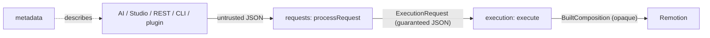
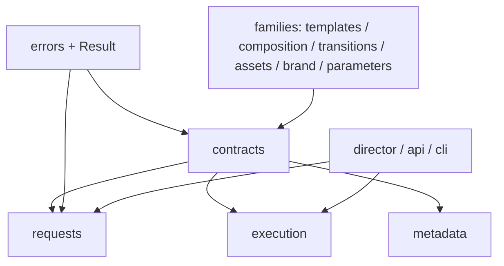

# ADR-008 — Request Processing Pipeline (the untrusted-input front-end)

- **Status:** Accepted — pending Phase 25 implementation
- **Date:** 2026-07-19
- **Deciders:** Framework architecture
- **Related:** ADR-001 (registry kernel), ADR-005 (templates — the request shape `TemplateCompositionBase`),
  ADR-006 (parameters — semantic param validation), ADR-007 (execution — consumes a typed
  `ExecutionRequest`; `DomainError`/`sanitize`/append-only report). This layer is the syntax
  front-end to ADR-007's semantic middle-end.

---

## 1. Context

The Execution Engine (ADR-007) assumes it receives a **valid, typed `ExecutionRequest`**
(`= TemplateCompositionBase`). That assumption holds only while requests are hand-authored in
TypeScript. Once requests originate from an **AI Director, Studio, a REST API, a CLI, plugins, or a
third-party SDK**, they arrive as **untrusted JSON** — possibly malformed, versioned to an older
shape, or carrying non-serializable values. There is today no layer that turns arbitrary external
input into a guaranteed-valid request, and no neutral home for the request contract itself (it lives
inside `templates`, and the registries bundle lives inside `execution`).

## 2. Problem

Provide a **registry-agnostic front-end** that converts untrusted input into a **guaranteed-valid,
guaranteed-serializable `ExecutionRequest`** — validating *transport syntax*, applying *version
migrations*, and *canonicalizing* the envelope — **without owning any semantics** (existence, schema,
rendering). Simultaneously, extract the shared request/registries **contract** into a neutral module
so the front-end, execution, and metadata layers depend on one protocol, not on each other.

## 3. Alternatives considered

- **A. Validate inside Execution.** Mixes syntax with semantics, gives no version boundary, and
  forces `execute()` to defend against untrusted input — rejected.
- **B. Trust producers to emit valid requests.** Unsafe; an AI/REST caller *will* emit malformed
  JSON — rejected.
- **C. A dedicated, registry-agnostic Request Processing layer producing a guaranteed-JSON
  `ExecutionRequest`, plus a neutral `contracts` module for the shared protocol (chosen).** The
  compiler front-end: parse → migrate → validate → normalize, feeding the existing back-end.

## 4. Decision

A new top layer **`src/requests/`** — a **sibling of `execution`** — turns untrusted input into a
validated `ExecutionRequest` via a fixed pipeline, returning a `Result` with an append-only report.
A new neutral **`src/contracts/`** module owns the shared request + registries + protocol types.



### 4.1 Architectural invariant — syntax vs. semantics

This split is a **hard architectural invariant**, testable and non-negotiable:

> **Request Processing validates *syntax*** — the structure, version, and JSON-safety of the
> transport envelope. **Execution validates *semantics*** — existence and parameter-schema
> conformance against the real registries.
>
> Request Processing **MUST NOT** access any registry, check whether a template/brand/asset exists,
> or validate parameters against a template's schema. Execution **MUST NOT** re-parse, re-version,
> or re-canonicalize untrusted input.

Neither layer duplicates the other; the boundary is drawn once, here.

### 4.2 Layer placement + the shared `contracts` module

**`src/contracts/`** (neutral, above the families, below the top consumers) owns the protocol that
`requests`, `execution`, and `metadata` share — resolving the coupling risk instead of deferring it:

```ts
// contracts — the neutral protocol (types only; no runtime, no React).
export type ExecutionRequest = TemplateCompositionBase;                 // the request contract (MVP: template-driven)
export type FrameworkRegistries = {                                     // the registries bundle (was ExecutionRegistries)
  templates: TemplateResolver; scenes: SceneResolver; transitions: TransitionResolver;
  assets: AssetRegistry; brands: BrandRegistry; parameterTypes?: ParameterTypeResolver; validators?: ValidatorResolver;
};
export type RegistryFamily = "scenes" | "transitions" | "assets" | "brands" | "templates" | "parameterTypes" | "validators";

// Shared, stage-parameterized diagnostic protocol (unifies the execution + request report shapes).
export type Diagnostic<S extends string> = { stage: S; code: string; message: string; path?: string; expected?: DiagnosticValue; actual?: DiagnosticValue };
export type Issue<S extends string>   = Diagnostic<S> & { severity: "error" };
export type Warning<S extends string> = Diagnostic<S> & { severity: "warning" };
export type Span<S extends string>    = { stage: S; status: "ok" | "failed" | "skipped"; note?: string; counts?: Record<string, number> };
export type Report<S extends string>  = { trace: Span<S>[]; issues: Issue<S>[]; warnings: Warning<S>[] };
```

`contracts` depends **downward, type-only** on the family modules (for the resolver types +
`TemplateCompositionBase`) and on `errors` (`DiagnosticValue`). No family imports `contracts`, so
there is no cycle. `Result<T, E>` relocates to `errors` (the domain-free low module) so `parameters`,
`execution`, and `requests` share one `Result` without a `parameters → contracts` cycle; barrels
re-export it for back-compat. `execution` adopts `FrameworkRegistries`/`ExecutionRequest` and
`Report<ExecutionStage>` from `contracts`; `requests` and `metadata` do likewise. **Nothing imports
`requests`** except the composing app/Director.

### 4.3 Type system

```ts
type RawInput = string | unknown;                     // untrusted: a JSON string or a parsed value
type RawExecutionRequest = Record<string, unknown>;   // post-parse, pre-validation

type RequestEnvelope = VideoConfigInput & {           // the STRUCTURE validated here; `params` stays opaque
  version?: RequestSchemaVersion; id: string; template: string;
  brand?: string | BrandConfig; theme?: ThemeMode;
  transitions?: TransitionConfigBase; music?: MusicConfig; timing?: TimingConfig;
};
type NormalizedExecutionRequest = ExecutionRequest;   // guaranteed serializable; the type Execution consumes

type RequestStage = "parse" | "migrate" | "validate-envelope" | "normalize" | "apply-defaults" | "complete";
type RequestIssue   = Issue<RequestStage>;            // from contracts
type RequestWarning = Warning<RequestStage>;
type RequestReport  = Report<RequestStage> & { requestId: string; fromVersion?: RequestSchemaVersion; toVersion: RequestSchemaVersion };

type RequestResult =
  | { ok: true;  request: NormalizedExecutionRequest; report: RequestReport }
  | { ok: false; report: RequestReport };

type RequestSchemaVersion = string;                   // CURRENT_REQUEST_VERSION is an engine constant
type Migration = (raw: RawExecutionRequest) => RawExecutionRequest;   // pure, defensive, SINGLE-STEP vN → vN+1 (§4.8)
type RequestContext = {                               // registry-FREE options
  targetVersion?: RequestSchemaVersion; migrations?: Registry<Record<RequestSchemaVersion, Migration>>; requestId?: string;
};

function processRequest(input: RawInput, ctx?: RequestContext): RequestResult;                 // Result boundary
function processRequestOrThrow(input: RawInput, ctx?: RequestContext): NormalizedExecutionRequest; // convenience
```

### 4.4 The pipeline

```
RawInput (untrusted)
  → parse              JSON.parse if string; else accept; guard "is object" → RawExecutionRequest
  → migrate            detect version (absent ⇒ baseline); apply single-step chain vN→vN+1→…→current (§4.8)
  → validate-envelope  AUTHORITATIVE structural gate against the CURRENT grammar (shapes only, no registries)
  → normalize          canonicalize the transport envelope + collapse deprecated aliases (+ warnings) (§4.5)
  → apply-defaults     envelope-level defaults only (params:{}, derive requestId) — NOT parameter defaults
  → NormalizedExecutionRequest (guaranteed JSON-safe)
```

**Migrate precedes validate** (compiler-correct): transform to the current grammar, then validate
once against it. Migrations are defensive over unknown input; `validate-envelope` is the single
authoritative structural gate. Each stage appends to the append-only report; a failing stage halts
and marks the remainder skipped.

### 4.5 Canonicalization scope

`normalize` performs **transport canonicalization only**: trim/normalize identifier strings (`id`,
`template`, `brand`-name), canonicalize the `brand` form (string vs. inline), collapse deprecated
aliases, and quarantine unknown fields — **each change emitting a `RequestWarning` (never silent)**.
It **does not** interpret or own any **rendering semantics**: it never judges whether a
`transitions.duration` is sensible, whether a `format` is renderable beyond shape, or what `params`
mean. Canonicalization is transport hygiene; rendering interpretation belongs to Execution.

### 4.6 Error model

**Always `Result`; never throw for expected bad input** — malformed input is the *normal* case at
the untrusted boundary. `processRequest` catches `JSON.parse`'s throw → `invalid-json` issue;
classifies a migration's `DomainError` → issue (stage-tagged, `sanitize`d); and **rethrows any
unexpected error** (a migration bug) — framework defects are never masked. `processRequestOrThrow`
is the only throwing surface (aggregates on `!ok`), mirroring `executeOrThrow`.

### 4.7 Serialization boundary

**Enters:** untrusted `unknown`. **Exits (ok):** a `NormalizedExecutionRequest` whose envelope is
JSON-safe **and** whose `params` are validated as a JSON *value* — the whole request is
**guaranteed `JSON.stringify`-able**. **Exits (always):** a JSON-safe `RequestReport`. React
elements / functions / class instances in the input are **rejected (issue) or sanitized** — they
can never cross into a processed request. This upgrades `params` from Execution's "JSON by
convention" to **"JSON guaranteed"** — the hardening the framework lacked.

### 4.8 Versioning & single-step migrations

- The request carries an optional `version`; absent ⇒ **baseline `"1"`**. `CURRENT_REQUEST_VERSION`
  is a constant this layer owns.
- **Migrations advance exactly one version (`vN → vN+1`).** A `Migration` never jumps multiple
  versions; the `migrate` stage **composes** a longer upgrade by chaining successive single-step
  migrations from the detected version up to current. Each step is small, pure, and independently
  testable; the chain is the composition.
- Migrations live **in this layer** (`src/requests/migrations/`), registered in a version-keyed
  registry, so **Execution only ever sees the current shape**.
- **Deprecated fields:** a single-step migration renames/moves them; `normalize` emits a
  `deprecated-field` warning while still accepting, until a later major version removes them. A
  version older than the supported window yields an explicit `unsupported-version` issue — never a
  silent misparse.

### 4.9 Relationship to Metadata & Execution

Three **non-overlapping** ownerships: **Metadata** describes *what's offered* (feeds producers);
**Requests** validates *is it well-formed + current* (registry-agnostic); **Execution** resolves
*does it resolve against the real registries*. Data flows
`Metadata → producer → (JSON) → Requests → (ExecutionRequest) → Execution`. Request Processing does
**not** call Metadata and holds **no registries**; it does not validate `params` against Metadata's
exported JSON-Schema (that would duplicate the Parameter Engine).

### 4.10 Architectural boundaries (the Request Processing Engine will NEVER)

- access a **registry** or check **existence** (template/brand/asset);
- validate **parameters** against a template's schema (Parameter Engine's job);
- **render**, build a composition, or call `buildComposition` / `execute`;
- own or interpret **rendering semantics** beyond validating the transport envelope (§4.5);
- **throw** for expected bad input (always `Result`); mask an unexpected error (always rethrow);
- emit **non-deterministic** output (no timestamps / random ids / order dependence);
- silently drop or coerce a field (every normalization/migration change is a warning);
- let **React** cross into a processed request.

Its sole job: **untrusted input → a guaranteed-valid, guaranteed-serializable `ExecutionRequest`
(or issues).**

## 5. Dependency impact (no cycles)



- **New `src/contracts/`** — neutral protocol (request contract, `FrameworkRegistries`, `RegistryFamily`,
  the `Diagnostic<S>`/`Report<S>` generics). Type-only downward deps on families + `errors`.
- **`Result<T,E>` relocates to `errors`** (domain-free low module); barrels re-export for back-compat.
- **New `src/requests/`** — sibling of `execution`; depends on `contracts` + `errors`; **not** on
  `execution`'s runtime. Nothing imports it except the composing app.
- **`execution` adopts** `FrameworkRegistries`/`ExecutionRequest`/`Report<ExecutionStage>` from
  `contracts` (its `ExecutionRegistries` becomes an alias/removal). No back-edges → **no cycle.**

## 6. Backward compatibility

Purely additive to runtime behaviour. `execute()`, `buildFromTemplate()`, and the engines are
unchanged; the `contracts` extraction + `Result` relocation are re-exported through existing barrels
so current imports keep working. Nothing consumes `requests` by default → the demo renders
**byte-identical**.

## 7. Migration plan (Phase 25 = request-processing core)

1. `src/contracts/` — `ExecutionRequest`, `FrameworkRegistries`, `RegistryFamily`, `Diagnostic<S>`/
   `Issue`/`Warning`/`Span`/`Report<S>`; relocate `Result` to `errors`; re-export from barrels.
2. `execution` adopts the `contracts` types (`ExecutionRegistries` → `FrameworkRegistries`); no
   behaviour change; existing tests green.
3. `src/requests/` — types, `CURRENT_REQUEST_VERSION`, the single-step migration registry, the
   pipeline (`parse → migrate → validate-envelope → normalize → apply-defaults`), `processRequest`
   (`Result`) + `processRequestOrThrow`, JSON-safety enforcement, the append-only report.
4. Tests (§9) incl. the syntax-vs-semantics invariant + dependency-direction assertions.

## 8. Risks

| Risk | Severity | Mitigation |
|---|---|---|
| Validation duplication / drift with Execution | Medium | §4.1 invariant: Requests = syntax, no registries; Execution = semantics. Enforced by a no-registry-import test. |
| Migration sprawl | Medium | Single-step (`vN→vN+1`) pure migrations; chain composition; last-N-versions window; explicit `unsupported-version`. |
| Silent over-normalization | Medium | Every canonicalization/migration change emits a warning; append-only report. |
| Request-type coupling (Requests + Execution) | Low | The `contracts` extraction gives both one source of truth (this ADR, not deferred). |
| Two reports (Request + Execution) increase caller load | Low | Unified `Diagnostic<S>`/`Report<S>` protocol from `contracts`; identical `Result` discipline. |
| `params` JSON-guarantee cost / false rejects | Low | Validate `params` as a JSON *value* once; deep *schema* validation stays in Execution. |

## 9. Testing strategy

- **Pure:** parse (string + value + invalid-json), single-step migration composition (v1→v2→v3),
  envelope validation (shape failures with paths), canonicalization (trim/alias/quarantine + warnings),
  envelope defaults, **JSON-safety enforcement** (a `params` with a function/node → rejected or
  sanitized; output always `JSON.stringify`-able), determinism, `Result` (no throw for bad input),
  `DomainError`→issue vs. unexpected→rethrow.
- **Invariant:** a **no-registry-import** assertion for `src/requests/` (syntax layer touches no
  registry); a describing/parity test that a processed request feeds `execute` identically to a
  hand-built one.
- **Structural:** `RequestReport` JSON round-trip; append-only trace; halt-and-skip semantics.
- **Regression / boundary:** demo byte-identical; **dependency-direction** (nothing imports
  `requests`; `contracts` has no family back-edge; no cycles).

## 10. Future extension points

A **discriminated request union** (schema-direct `CompositionSchema` execution alongside
template-driven); request **batching** and **streaming ingestion**; **signed / authenticated**
envelopes; a producer-side **JSON-Schema** of the envelope (from `contracts`) so producers validate
before sending; per-version **envelope grammars** if validate-per-version is ever needed; promoting
more shared protocol types into `contracts` as consumers appear.
