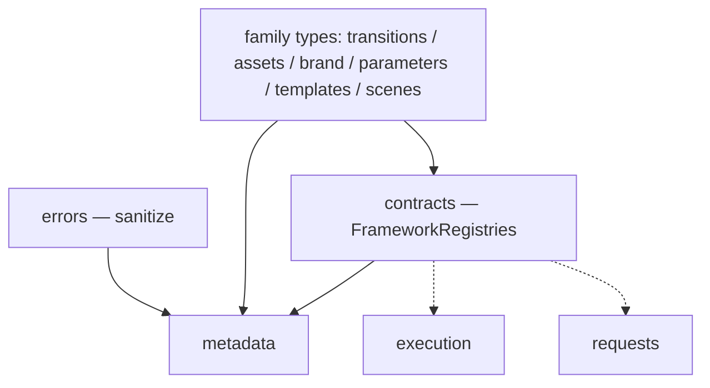

# ADR-009 — Metadata Engine (a pure reflection / description layer)

- **Status:** Accepted — pending implementation *after* the ADR-008 Request Processing and
  `contracts` core is implemented.
- **Date:** 2026-07-19
- **Deciders:** Framework architecture
- **Related:** ADR-001 (registry kernel — `keys()`/`require()`), ADR-002 (`TransitionCapabilities`),
  ADR-003 (`AssetDefinition`/`AssetMetadata`), ADR-004 (`BrandDefinition`), ADR-005
  (`TemplateDefinition` + `capabilities`/`meta`), ADR-006 (`ParameterSchema` — fully JSON),
  ADR-007 (execution — the reflective twin; `sanitize`/`DiagnosticValue`), **ADR-008
  (`contracts` — `FrameworkRegistries`; a hard sequencing dependency)**.

---

## 1. Context

Every consumer that isn't the renderer — an AI Director, Studio, a docs generator, a REST API, a
CLI — needs to ask *"what does this framework offer?"* **without executing anything**. That
describable metadata is trapped inside code-bearing `Definition`s: a `TemplateDefinition` mixes JSON
`capabilities`/`parameters`/`meta` with a `build` function; a `TransitionDefinition` mixes JSON
`capabilities` with a `presentation`. The Execution Engine serializes a *run*; nothing serializes
the *framework itself*. ADR-008 introduces `contracts` with a neutral `FrameworkRegistries` bundle —
the clean input for reflection — so this layer is built **after** that extraction.

## 2. Problem

Provide a **pure, read-only reflection layer** that projects each definition's serializable,
declarative fields into **descriptors**, aggregates them into a serializable `FrameworkDescriptor`
and a rolled-up `CapabilityReport`, and answers "what exists / what can this framework do" — never
executing, rendering, mutating a registry, or building a composition.

## 3. Alternatives considered

- **A. A registry family.** Rejected — there is nothing to register or select; Metadata *reads* the
  other registries and *projects* descriptors. A registry whose entries are never selected is a
  false parallel.
- **B. A `describe()` method on each engine.** Rejected — scatters reflection across engines and
  couples the engines upward to a descriptor format.
- **C. A pure, stateless description layer that projects descriptors (chosen).** The read-only twin
  of the Execution Engine; one neutral contract for every consumer.
- **D. An offline documentation generator only.** Rejected — not queryable at runtime by an AI
  Director / REST layer.

## 4. Decision

A new top layer **`src/metadata/`** — pure, stateless, read-only. It consumes `FrameworkRegistries`
(from `contracts`), reads each registry via `keys()`/`require()`, and returns **typed, JSON-safe,
deterministic** descriptors. The **MVP is Description only**: the neutral `describe*` APIs and
`getCapabilities()`. It is not a registry, holds no state, and nothing imports it.

### 4.1 Layer placement

`metadata` depends **downward** on `contracts` (`FrameworkRegistries`), the family **definition
types** (for descriptor *output* types), and `errors` (`sanitize`). It reads inputs **erased**
(`require(key) → Def<any>`, exactly as `execution` does) and emits **typed** descriptors — reflection
needs the family types for its output even though its input is erased. There is **no
`metadata → execution` edge** (execution-stage description is deferred; execution owns its own
pipeline). Metadata is a **leaf**; nothing imports it.

### 4.2 Descriptor model — pure projection

A descriptor is `project(Definition, key)` — a **total, deterministic function** that copies an
explicit allow-list of serializable fields and adds only derivable identity (`qualifiedName`). It
**stores nothing, authors nothing, persists nothing**; the `Definition` in its registry remains the
**single source of truth**. Descriptors are ephemeral immutable JSON values, never a second source
of truth.

**Honesty limits (documented, not bugs):**
- **Declared, not dynamic** — asset/brand references are visible only where **declared** (parameter
  schemas of type `image`/`brand`, brand `logos`), never from inside `build()` (which is never run).
- **Scene gap** — scenes carry no `ParameterSchema`, so a `SceneDescriptor` describes only
  `defaultDuration`/`opaque`. A future `SceneMetadata` (deferred) closes it.

### 4.3 Type relationships

```ts
type DescriptorIdentity = { key: string; qualifiedName: string; name?: string };
// key = the registry key (CANONICAL — what consumers select by); qualifiedName = `${family}:${key}`
// (globally unique cross-family); name = the definition's display name (DISPLAY only, may differ, not unique).

type TemplateDescriptor      = DescriptorIdentity & { format?: FormatName; capabilities?: TemplateCapabilities; parameters?: ParameterSchema; meta?: TemplateMetadata };
type BrandDescriptor         = DescriptorIdentity & { mode?: ThemeMode; hasTheme: boolean; fontFamilies: string[]; logos?: { primary?: string; alternate?: string; watermark?: string }; kitAssets?: string[]; meta?: BrandMeta };
type AssetDescriptor         = DescriptorIdentity & { category: AssetCategory; roles?: AssetRole[]; metadata?: AssetMetadata; source?: AssetSourceSummary };

// Accepted refinement — the DECLARED source, reported exactly as authored. Metadata never resolves,
// loads, validates, imports, hashes, or transforms it (no fs/CDN resolution, no signed URLs, no
// probing). A bare string source is classified purely syntactically (http(s):// → url, else file).
type AssetSourceSummary =
  | { kind: "file"; path: string }   // project-relative path
  | { kind: "url"; url: string }
  | { kind: "inline" };              // reserved source kinds (gradient/inline markup)
type TransitionDescriptor    = DescriptorIdentity & { capabilities: TransitionCapabilities };
type SceneDescriptor         = DescriptorIdentity & { defaultDuration: number; opaque: boolean };
type ParameterTypeDescriptor = DescriptorIdentity & { ui?: ParameterUIHints; capabilities?: ParameterCapabilities };
type ValidatorDescriptor     = DescriptorIdentity;
type RegistryDescriptor      = { family: RegistryFamily; keys: string[]; count: number };

type CapabilityReport = {
  formats: FormatName[]; assetCategories: AssetCategory[]; parameterTypes: string[];
  transitions: { supportsTransparency: string[]; requiresOpaqueIncoming: string[] };
  templatesRequiringBrand: string[]; counts: Record<RegistryFamily, number>;
};

type FrameworkDescriptor = {
  schemaVersion: string;          // METADATA-owned constant — the descriptor-format version
  frameworkVersion?: string;      // OPTIONAL, caller-supplied — the engine never reads disk/clock/env
  registries: RegistryDescriptor[];
  templates: TemplateDescriptor[]; brands: BrandDescriptor[]; assets: AssetDescriptor[];
  transitions: TransitionDescriptor[]; scenes: SceneDescriptor[];
  parameterTypes: ParameterTypeDescriptor[]; validators: ValidatorDescriptor[];
  capabilities: CapabilityReport;
  // custom?: Record<string, unknown[]>   ← RESERVED (third-party describers); NOT in the MVP
};
```

`TemplateDescriptor.parameters` is the `ParameterSchema` verbatim (already fully JSON), so *"what
parameters does template X require?"* is answered directly — no re-derivation.

### 4.4 Public API (Description only)

```ts
describeFramework(registries?: Partial<FrameworkRegistries>, opts?: { frameworkVersion?: string }): FrameworkDescriptor

describeTemplates(templates?): TemplateDescriptor[]
describeTemplate(key: string, templates?): TemplateDescriptor | undefined
describeBrands(brands?): BrandDescriptor[]
describeAssets(assets?): AssetDescriptor[]
describeTransitions(transitions?): TransitionDescriptor[]
describeScenes(scenes?): SceneDescriptor[]
describeParameterTypes(types?): ParameterTypeDescriptor[]
describeValidators(validators?): ValidatorDescriptor[]
describeRegistries(registries?): RegistryDescriptor[]

getCapabilities(registries?): CapabilityReport
```

Every function is pure, synchronous, read-only, returns JSON-safe data, and takes registries by DI
(defaulting to the built-ins).

### 4.5 Ownership & architectural boundaries

Metadata **owns**: projecting Definitions → descriptors; aggregating `CapabilityReport`; deterministic
JSON-safe output; the `schemaVersion` constant. Metadata **will NEVER**:

- execute any code — `build` / `validate` / `parse` / `presentation` / any function-valued field;
- render, or import/construct React;
- mutate a registry (never `.extend`, never write) or persist a descriptor;
- build a composition or call `buildComposition` / `execute`;
- read the filesystem, clock, or environment (`frameworkVersion` is caller-supplied);
- hold mutable state or an internal cache;
- become authoritative — **Definitions remain the source of truth**;
- emit nondeterministic output (no timestamps, random ids, or map-order dependence).

Its sole job: **registries → serializable descriptors.**

### 4.6 Serialization boundary

Every descriptor is **pure JSON by construction** — projectors copy an explicit allow-list and
exclude every code field (`component`/`build`/`validate`/`presentation`/kit closures). The one
wildcard, `TemplateMetadata.previewParams`, is passed through **`sanitize()`** (from `errors`).
Guarantee: `describeFramework(...)` is always `JSON.stringify`-able; **React never enters a
descriptor**. Determinism: every list is **sorted by `key`**; no timestamps/random/order-dependence.

### 4.7 Capability aggregation

`getCapabilities` is **computed on demand and never cached or materialized inside the engine** —
caching would create a second source of truth; an internal cache would add staleness. Because
registries are immutable (`extend` returns a new instance), a **consumer** may safely memoize keyed
by registry identity — a consumer optimization, not engine state.

### 4.8 Versioning

`schemaVersion` (the descriptor-format version) is a **Metadata-owned constant**, a *different*
version line from `contracts`' `CURRENT_REQUEST_VERSION`. `frameworkVersion` is **optional and
caller-supplied**; the engine never reads it from disk (purity/determinism).

### 4.9 Consumers compose their own views

Metadata stays **neutral**. Consumer-specific projections do **not** live here:
- The **AI Director** (ADR-010) composes its selection view from `describeTemplates()` (key +
  `parameters` + `capabilities` + `meta.description`) + `describeBrands()`/`describeAssets()` +
  `getCapabilities()`. No `DirectorDescriptor` in Metadata.
- **Studio** reads `FrameworkDescriptor` / `describeTemplates` directly — the `ParameterSchema`
  (with `ui`/`metadata`/`groups`) already drives its forms. No `StudioDescriptor`.

### 4.10 Deferred (reserved, not built)

- **Analysis** — cross-reference/lint (`analyzeReferences`) and **dependency graphs**
  (`describeDependencyGraph`). The declared references already live inside the descriptors; a graph
  is a heavy structure ahead of any consumer.
- **`describeExecutionStages`** — execution owns its own pipeline; describing it would force a
  `metadata → execution` edge for a non-registry concern.
- **Scene metadata / schema** — closes the scene gap when scene-level params matter.
- **Third-party describers** — a `describerRegistry` + the `custom` slot; **no `extensions` bag on
  core descriptors** (anti-pollution).
- **Consumer projections** — `DirectorDescriptor` / `StudioDescriptor` belong with their consumers.

## 5. Dependency impact (no cycles)



`metadata → { contracts, family types, errors }`. No family, `contracts`, `execution`, or `requests`
imports `metadata`. Metadata is a **leaf** → **no cycle** (enforced by a dependency-direction test).

## 6. Backward compatibility

Purely additive and **inert** — nothing consumes `metadata` by default, so the demo renders
**byte-identical**. No runtime behaviour changes in any existing engine.

## 7. Migration plan

**Sequencing is a hard dependency:** Metadata is implemented **only after** ADR-008's Request
Processing + `contracts` core lands (which defines `FrameworkRegistries`).

1. *(ADR-008, first)* `contracts` — `FrameworkRegistries`, `RegistryFamily`, shared protocol;
   `Result` relocated to `errors`; `execution` adopts the contracts types.
2. *(This ADR, after)* `src/metadata/` — the family projectors, `getCapabilities`,
   `FrameworkDescriptor` + `schemaVersion`. Description only.

**Deferred:** Analysis (references lint, dependency graph), execution-stage description, scene
metadata, third-party describers, consumer-specific projections.

## 8. Risks

| Risk | Severity | Mitigation |
|---|---|---|
| Serializing code (component/build/kit) | High | explicit allow-list projection; `sanitize` the one wildcard; a test asserts no functions + JSON round-trip |
| Over-promising references (declared vs dynamic) | Medium | documented limit; analysis deferred |
| Descriptor/Definition drift | Medium | descriptors derived from definition types; coverage test |
| Sequencing on an unbuilt `contracts` | Medium | Metadata implemented strictly after ADR-008 (stated order) |
| Non-deterministic output (map order) | Low | sort every list by `key`; determinism test |
| Scene gap misread as a defect | Low | documented limit + reserved `SceneMetadata` |

## 9. Testing strategy

- **Pure:** each `describe*` projects the correct fields from fixture registries; **no code leakage**
  (`JSON.stringify(describeFramework())` succeeds; deep scan finds no `function`); **determinism**
  (sorted, stable across calls); `getCapabilities` aggregation.
- **No-execution guarantee (defining test):** a template whose `build`/`validate` **throws** is still
  fully describable — this layer only describes.
- **Structural:** `FrameworkDescriptor` shape; JSON round-trip equality.
- **Regression / boundary:** demo byte-identical; **dependency-direction** (nothing imports
  `metadata`; `metadata` calls no `execute` and mutates no registry).

## 10. Future extension points

Analysis (`analyzeReferences`, dependency graph); a JSON-Schema / OpenAPI export from
`TemplateDescriptor.parameters` (feeds the AI Director / REST); a documentation generator consuming
`FrameworkDescriptor`; `describeExecutionStages` (owned by execution); `SceneMetadata`; a
`describerRegistry` for third-party families; capability diffing across `FrameworkDescriptor`
versions.
